# Паттерны проектирования

[На главную](../../README.md)

Источники:

- <a href="https://thebestcode.ru/public/books/design_patterns.pdf">"Паттерны объектно-ориентированного проектирования". Банда четырех</a>
- <a href="https://refactoring.guru/ru/design-patterns">"Паттерны проектирования". Refactoring Guru</a>
- <a href="https://addyosmani.com/resources/essentialjsdesignpatterns/book/" target="_blank" rel="noopener">Learning JavaScript Design Patterns</a>
- <a href="https://github.com/fbeline/design-patterns-JS/blob/master/docs.md" target="_blank" rel="noopener">Design Patterns JS</a>
- <a href="https://github.com/sohamkamani/javascript-design-patterns-for-humans" target="_blank" rel="noopener">Design Patterns for Humans</a>
- <a href="https://github.com/tcorral/Design-Patterns-in-Javascript" target="_blank" rel="noopener">Design Patterns in Javascript ES6</a>

## Оглавление

- [Чта такое паттерн?](#pattern)
- [Проверка паттерна, прото-паттерны и правило трех](#check)
- [Структура паттерна](#structure)
- [Антипаттерны](#anti)
- [Категории паттернов](#category)

## <a name="pattern"></a> Что такое паттерн?

Паттерн - это решение распространенных проблем, возникающих при разработке программного обеспечения - в нашем случае - при написании приложений на JavaScript.

### Почему важно знать паттерны?

- Паттерны представляют собой подходы к решению задач в сфере разработки ПО, основанные на опыте большого количества профессиональных разработчиков.
- Паттерны могут быть легко адаптированы для наших нужд.
- Паттерны представляют собой общую схему решения однотипных задач.

Важно понимать, что паттерн - это не решение конкретной задачи, а лишь пример того, как подобные задачи решаются. Паттерны не могут решить все проблемы проектирования, поэтому они не заменяют собой хороших разработчиков, но помогают им решать их повседневные задачи. Вот еще несколько особенностей паттернов.

- Паттерны помогают своевременно выявлять и устранять неточности и недочеты, которые могут привести к серьезным проблемам в процессе разработки приложения.
- Паттерны представляют собой общие решения, они документируются без привязки к конкретной проблеме.
- Некоторые паттерны помогают уменьшить размер файла приложения за счет устранения повторений кода.
- Паттерны способствуют улучшению коммуникации между разработчиками.
- Популярные паттерны со временем совершенствуются использующими их разработчиками.

## <a name="check"></a> Проверка паттерна, прото-паттерны и правило трех

Не каждый алгоритм, передовая практика или хорошее решение являются паттерном. Решение, претендующее на роль паттерна, должно пройти проверку временем и соответствовать определенным критериям.
При изучении паттернов можно встретить термин "прото-паттерн". Что это такое? Простыми словами, прото-паттерн - это паттерн, еще не прошедший надлежащей проверки сообществом разработчиков. Прото-паттерн - это хорошее решение конкретной проблемы, которым разработчик данного решения решил поделиться с окружающими. Публикация прото-паттерна может сопровождаться его кратким описанием, которое называется "патлетом".

### Каким критериям должен соответствовать паттерн?

- Паттерн представляет собой решение определенной группы задач.
- Данное решение не является очевидным.
- Оно проверено и подтверждено большим количеством разработчиков.
- Паттерн содержит подробное описание и примеры его использования.

### О чем гласит правило трех?

- Паттерн должен соответствовать цели проектирования
- Он должен быть полезным
- Он должен решать больше одной задачи

## <a name="structure"></a> Структура паттерна

Паттерн состоит из следующих элементов:

- Название и описание
- Контекст - область применения паттерна
- Формалировка проблемы, решаемой паттерном
- Решение - пошаговое описание того, как решается проблема
- Алгоритм - описание действий пользователя при применении паттерна
- Общее руководство по реализации паттерна
- Иллюстрации (визуальная составляющая)
- Теоретическая основа
- Зависимости - использование других паттернов
- Отношения - связь с другими паттернами
- Примеры использования в реальных приложениях
- Обсуждения или комментарии - мысли команды или автора о преимуществах использования паттерна

## <a name="anti"></a> Антипаттерны

Если паттерн представляется собой лучшую практику, то антипаттерн - это извлеченный урок. Другими словами, антипаттерн - это пример того, как не следует решать определенную задачу.

Знание антипаттернов является не менее важным, чем знание паттернов, поскольку помогает обнаруживать проблемы на ранней стадии разработки приложения и своевременно их устранять.

Примеры антипаттернов в JavaScript:

- Загрязнение глобального пространства имен путем определения большого количества глобальных переменных
- Передача в setTimeout или setInterval в качестве аргументов строк вместо функций, что приводит к запуску eval()
- Изменение прототипа класса "Object" (и других встроенных прототипов)
- Использование встроенного (inline) JavaScript
- Использование document.write вместо document.createElement, например, и т.д.

## <a name="category"></a> Категории паттернов

Паттерны можно разделить на несколько категорий в зависимости от типа решаемых ими задач.

### Порождающие или творческие (Creational) паттерны

Порождающие паттерны сосредоточены на механизме создания объектов. Они отвечают за удобное и безопасное создание новых объектов или даже целых семейств объектов.

Примерами порождающих паттернов являются:

- [Фабрика (Factory) и абстрактная фабрика (Abstract Factory)](#factory)
- [Строитель (Builder)](#builder)
- [Конструктор (Constructor)](#constructor)
- [Прототип (Prototype)](#constructor)
- [Одиночка или Синглтон (Singleton)](#singleton)
- [Модуль (Module)](#module)

### Структурные (Structural) паттеры

Структурные паттерны связаны с композицией объектов и определяют отношения между ними. Они позволяют сделать так, чтобы изменение одной части системы не влияло на другие. Другими словами, они отвечают за построение удобных в поддержке иерархий классов.

К данной категории паттернов относятся:

- [Адаптер (Adapter)](#adapter)
- [Мост (Bridge)](#bridge)
- [Компоновщик (Composite)](#composite)
- [Декоратор (Decorator)](#decorator)
- [Фасад (Facade)](#facade)
- [Легковес или Приспособленец (Flyweight)](#flyweight)
- [Примесь или Миксин (Mixin)](#mixin)
- [Заместитель или Прокси (Proxy)](#proxy)

### Поведенческие (Behavioral) паттерны

Поведенческие паттерны направлены на улучшение взаимодействия между объектами системы. Они решают задачи эффективного и безопасного взаимодействия между отдельными частями приложения.

Примерами таких паттернов являются:

- [Цепочка обязанностей (Chain of Responsibility)](#resp)
- [Команда (Command)](#command)
- [Интерпретатор (Interpreter)](#interpret)
- [Итератор (Iterator)](#iterator)
- [Посредник или Медиатор (Mediator)](#mediator)
- [Снимок (Memento)](#memento)
- [Наблюдатель (Observer)](#observer)
- [Состояние (State)](#state)
- [Стратегия (Strategy)](#strategy)
- [Шаблон (Template)](#template)
- [Посетитель (Visitor)](#visitor)

Некоторые авторы также выделяют группу MV\* паттернов (MVC - Model-View-Controller, MVP - Model View Presenter, MVVM - Model-View-ViewModel и т.д.).

## Порождающие паттерны

### <a name="factory"></a> Фабрика и абстрактная фабрика

#### Фабрика

Фабрика (фабричный метод) — это порождающий паттерн проектирования, который определяет общий интерфейс для создания объектов в суперклассе, позволяя подклассам изменять тип создаваемых объектов.

#### Структура


1. Продукт определяет общий интерфейс объектов, которые может произвести создатель и его подклассы.
2. Конкретные продукты содержат код различных продуктов. Продукты будут отличаться реализацией, но интерфейс у них будет общий.
3. Создатель объявляет фабричный метод, который должен возвращать новые объекты продуктов. Важно, чтобы тип результата совпадал с общим интерфейсом продуктов.
4. Конкретные создатели по-своему реализуют фабричный метод, производя те или иные конкретные продукты.

#### Задача

В представленной ниже схеме Фабричный метод помогает создавать кросс-платформенные элементы интерфейса, не привязывая основной код программы к конкретным классам элементов.


Фабричный метод объявлен в классе диалогов. Его подклассы относятся к различным операционным системам. Благодаря фабричному методу, вам не нужно переписывать логику диалогов под каждую систему. Подклассы могут наследовать почти весь код из базового диалога, изменяя типы кнопок и других элементов, из которых базовый код строит окна графического пользовательского интерфейса.

Базовый класс диалогов работает с кнопками через их общий программный интерфейс. Поэтому, какую вариацию кнопок ни вернул бы фабричный метод, диалог останется рабочим. Базовый класс не зависит от конкретных классов кнопок, оставляя подклассам решение о том, какой тип кнопок создавать.

Такой подход можно применить и для создания других элементов интерфейса. Хотя каждый новый тип элементов будет приближать вас к Абстрактной фабрике.

#### Применимость

- Когда заранее неизвестны типы и зависимости объектов, с которыми должен работать ваш код
- Когда вы хотите дать возможность пользователям расширять части вашего фреймворка или библиотеки
- Когда вы хотите экономить системные ресурсы, повторно используя уже созданные объекты, вместо порождения новых

#### Абстрактная фабрика

Абстрактная фабрика — это порождающий паттерн проектирования, который позволяет создавать семейства связанных объектов, не привязываясь к конкретным классам создаваемых объектов.

#### Структура


1. Абстрактные продукты объявляют интерфейсы продуктов, которые связаны друг с другом по смыслу, но выполняют разные функции.
2. Конкретные продукты — большой набор классов, которые относятся к различным абстрактным продуктам (кресло/столик), но имеют одни и те же вариации (Викторианский/Модерн).
3. Абстрактная фабрика объявляет методы создания различных абстрактных продуктов (кресло/столик).
4. Конкретные фабрики относятся каждая к своей вариации продуктов (Викторианский/Модерн) и реализуют методы абстрактной фабрики, позволяя создавать все продукты определённой вариации.
5. Несмотря на то, что конкретные фабрики порождают конкретные продукты, сигнатуры их методов должны возвращать соответствующие абстрактные продукты. Это позволит клиентскому коду, использующему фабрику, не привязываться к конкретным классам продуктов. Клиент сможет работать с любыми вариациями продуктов через абстрактные интерфейсы.

#### Задача

В представленной ниже схеме Абстрактная фабрика создаёт кросс-платформенные элементы интерфейса и следит за тем, чтобы они соответствовали выбранной операционной системе.


Кросс-платформенная программа может показывать одни и те же элементы интерфейса, выглядящие чуточку по-другому в различных операционных системах. В такой программе важно, чтобы все создаваемые элементы всегда соответствовали текущей операционной системе. Вы бы не хотели, чтобы программа, запущенная на Windows, вдруг начала показывать чекбоксы в стиле macOS.

Абстрактная фабрика объявляет список создающих методов, которые клиентский код может использовать для получения тех или иных разновидностей элементов интерфейса. Конкретные фабрики относятся к различным операционным системам и создают элементы, совместимые с этой системой.

В самом начале программа определяет, какая из фабрик соответствует текущей операционке. Затем создаёт эту фабрику и отдаёт её клиентскому коду. В дальнейшем клиент будет работать только с этой фабрикой, чтобы исключить несовместимость возвращаемых продуктов.

Клиентский код не зависит от конкретных классов фабрик и элементов интерфейса. Он общается с ними через абстрактные интерфейсы. Благодаря этому клиент может работать с любой разновидностью фабрик и элементов интерфейса.

Чтобы добавить в программу новую вариацию элементов (например, для поддержки Linux), вам не нужно трогать клиентский код. Достаточно создать ещё одну фабрику, производящую эти элементы.

#### Применимость

- Когда бизнес-логика программы должна работать с разными видами связанных друг с другом продуктов, не завися от конкретных классов продуктов
- Когда в программе уже используется Фабричный метод, но очередные изменения предполагают введение новых типов продуктов

#### Примеры

Завод по производству BMW:

```js
class BmwFactory {
  static create(type) {
    if (type === 'X5') return new Bmw(type, 108000, 300)

    if (type === 'X6') return new Bmw(type, 111000, 320)
  }
}

class Bmw {
  constructor(model, price, maxSpeed) {
    this.model = model
    this.price = price
    this.maxSpeed = maxSpeed
  }
}

export default BmwFactory
```

Фабрика по созданию дроидов:

```js
const droidProducer = (kind) =>
  kind === 'battle' ? battleDroidFactory : pilotDroidFactory

const battleDroidFactory = () => new B1()
const pilotDroidFactory = () => new Rx24()

class B1 {
  info() {
    return 'B1, Battle Droid'
  }
}

class Rx24 {
  info() {
    return 'Rx24, Pilot Droid'
  }
}

export default droidProducer
```

Фабрика (и абстрактная фабрика) по производству автомобилей:

```js
// фабрика
function Car({ doors, state, color }) {
  this.doors = doors || 4
  this.state = state || 'новый'
  this.color = color || 'серебряный'
}

function Truck({ state, wheelSize, color }) {
  this.state = state || 'подержанный'
  this.wheelSize = wheelSize || 'большой'
  this.color = color || 'синий'
}

function VehicleFactory() {}
;(function () {
  this.vehicleClass = Car
  this.createVehicle = function (options) {
    switch (options.vehicleType) {
      case 'автомобиль':
        this.vehicleClass = Car
        break
      case 'грузовик':
        this.vehicleClass = Truck
    }
    return new this.vehicleClass(options)
  }
}.call(VehicleFactory.prototype))

const carFactory = new VehicleFactory()
const car = carFactory.createVehicle({
  vehicleType: 'автомобиль',
  color: 'желтый'
})
console.log(car instanceof Car) // true
console.log(car)
// Car {doors: 4, state: "новый", color: "желтый"}

const truck = carFactory.createVehicle({
  vehicleType: 'грузовик',
  state: 'как новый',
  color: 'красный',
  wheelSize: 'маленький'
})
console.log(truck instanceof Truck) // true
console.log(truck)
// Truck {state: "как новый", wheelSize: "маленький", color: "красный"}

/*
  function TruckFactory() {}
  TruckFactory.prototype = new VehicleFactory()
  TruckFactory.prototype.vehicleClass = Truck

  const truckFactory = new TruckFactory()
*/
const truckFactory = Object.create(new VehicleFactory().__proto__)
truckFactory.__proto__.vehicleClass = Truck
const bigTruck = truckFactory.createVehicle({
  state: 'очень плохое',
  color: 'черный',
  wheelSize: 'очень большой'
})
console.log(bigTruck instanceof Truck) // true
console.log(bigTruck)
// Truck {state: "очень плохое", wheelSize: "очень большой", color: "черный"}

// абстрактная фабрика
const abstractVehicleFactory = (() => {
  const types = {}
  return {
    getVehicle(type, customizations) {
      const Vehicle = types[type]
      return Vehicle ? new Vehicle(customizations) : null
    },
    registerVehicle({ type, Vehicle, available }) {
      if (available) {
        types[type] = Vehicle
      }
      return this
    }
  }
})()

abstractVehicleFactory
  .registerVehicle({
    type: 'car',
    Vehicle: Car,
    available: true
  })
  .registerVehicle({
    type: 'truck',
    Vehicle: Truck,
    available: false
  })

const car2 = abstractVehicleFactory.getVehicle('car', {
  color: 'зеленый',
  state: 'среднее'
})
const truck2 = abstractVehicleFactory.getVehicle('truck', {
  wheelSize: 'средний',
  color: 'серый'
})
console.log(car2 instanceof Car) // true
console.log(car2)
// Car {doors: 4, state: "среднее", color: "зеленый"}
console.log(truck2 instanceof Truck) // false
console.log(truck2) // null
```

### <a name="builder"></a> Строитель

Строитель — это порождающий паттерн проектирования, который позволяет создавать сложные объекты пошагово. Строитель даёт возможность использовать один и тот же код строительства для получения разных представлений объектов.

#### Структура


1. Интерфейс строителя объявляет шаги конструирования продуктов, общие для всех видов строителей.
2. Конкретные строители реализуют строительные шаги, каждый по-своему. Конкретные строители могут производить разнородные объекты, не имеющие общего интерфейса.
3. Продукт — создаваемый объект. Продукты, сделанные разными строителями, не обязаны иметь общий интерфейс.
4. Директор определяет порядок вызова строительных шагов для производства той или иной конфигурации продуктов.
5. Обычно Клиент подаёт в конструктор директора уже готовый объект-строитель, и в дальнейшем данный директор использует только его. Но возможен и другой вариант, когда клиент передаёт строителя через параметр строительного метода директора. В этом случае можно каждый раз применять разных строителей для производства различных представлений объектов.

#### Задача

В представленной ниже схеме Строитель используется для пошагового конструирования автомобилей, а также технических руководств к ним.

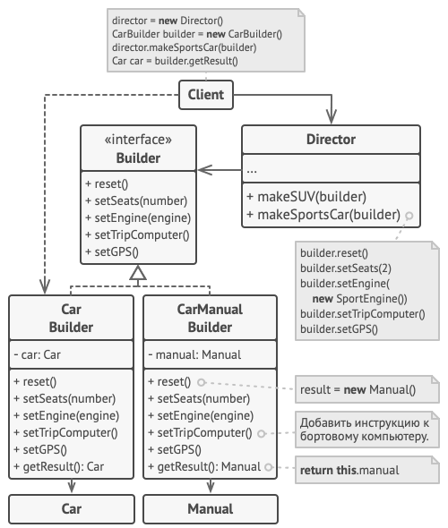

Автомобиль — это сложный объект, который может быть сконфигурирован сотней разных способов. Вместо того, чтобы настраивать автомобиль через конструктор, мы вынесем его сборку в отдельный класс-строитель, предусмотрев методы для конфигурации всех частей автомобиля.

Клиент может собирать автомобили, работая со строителем напрямую. Но, с другой стороны, он может поручить это дело директору. Это объект, который знает, какие шаги строителя нужно вызвать, чтобы получить несколько самых популярных конфигураций автомобилей.

Но к каждому автомобилю нужно ещё и руководство, совпадающее с его конфигурацией. Для этого мы создадим ещё один класс строителя, который вместо конструирования автомобиля, будет печатать страницы руководства к той детали, которую мы встраиваем в продукт. Теперь, пропустив оба типа строителей через одни и те же шаги, мы получим автомобиль и подходящее к нему руководство пользователя.

Очевидно, что бумажное руководство и железный автомобиль — это две разных вещи, не имеющих ничего общего. По этой причине мы должны получать результат напрямую от строителей, а не от директора. Иначе нам пришлось бы жёстко привязать директора к конкретным классам автомобилей и руководств.

#### Применимость

- Когда вы хотите избавиться от «телескопического конструктора».
- Когда ваш код должен создавать разные представления какого-то объекта. Например, деревянные и железобетонные дома.
- Когда вам нужно собирать сложные составные объекты, например, деревья Компоновщика.

#### Примеры

Строитель HTTP-запроса:

```js
class Request {
  constructor() {
    this.url = ''
    this.method = ''
    this.payload = {}
  }
}

class RequestBuilder {
  constructor() {
    this.request = new Request()
  }
  forUrl(url) {
    this.request.url = url
    return this
  }
  useMethod(method) {
    this.request.method = method
    return this
  }
  payload(payload) {
    this.request.payload = payload
    return this
  }
  build() {
    return this.request
  }
}

export default RequestBuilder
```

Строитель гамбургера:

```js
class Burger {
  constructor(/* builder */ { size, cheeze, pepperoni, lettuce, tomato }) {
    // this.size = builder.size
    this.size = size
    this.cheeze = cheeze || false
    this.pepperoni = pepperoni || false
    this.lettuce = lettuce || false
    this.tomato = tomato || false
  }
}

class BurgerBuilder {
  constructor(size) {
    this.size = size
  }
  addCheeze() {
    this.cheeze = true
    return this
  }
  addPepperoni() {
    this.pepperoni = true
    return this
  }
  addLettuce() {
    this.lettuce = true
    return this
  }
  addTomato() {
    this.tomato = true
    return this
  }
  build() {
    return new Burger(this)
  }
}

const burger = new BurgerBuilder(14).addCheeze().addTomato().build()
console.log(burger)
// Burger {size: 14, cheeze: true, pepperoni: false, lettuce: false, tomato: true}
```

### <a name="constructor"></a> Конструктор и прототип

Прототип — это порождающий паттерн проектирования, который позволяет копировать объекты, не вдаваясь в подробности их реализации.

#### Структура


1. Интерфейс прототипов описывает операции клонирования. В большинстве случаев — это единственный метод clone.
2. Конкретный прототип реализует операцию клонирования самого себя. Помимо банального копирования значений всех полей, здесь могут быть спрятаны различные сложности, о которых не нужно знать клиенту. Например, клонирование связанных объектов, распутывание рекурсивных зависимостей и прочее.
3. Клиент создаёт копию объекта, обращаясь к нему через общий интерфейс прототипов.

#### Реализация с общим хранилищем прототипов


1. Хранилище прототипов облегчает доступ к часто используемым прототипам, храня набор предварительно созданных эталонных, готовых к копированию объектов. Простейшее хранилище может быть построено с помощью хеш-таблицы вида имя-прототипа → прототип. Но для удобства поиска прототипы можно маркировать и другими критериями, а не только условным именем.

#### Задача

В представленной ниже схеме Прототип позволяет производить точные копии объектов геометрических фигур, не привязываясь к их классам.


Все фигуры реализуют интерфейс клонирования и предоставляют метод для воспроизводства самой себя. Подклассы используют метод клонирования родителя, а затем копируют собственные поля в получившийся объект.

#### Применимость

- Когда ваш код не должен зависеть от классов копируемых объектов
- Когда вы имеете уйму подклассов, которые отличаются начальными значениями полей. Кто-то мог создать все эти классы, чтобы иметь возможность легко порождать объекты с определённой конфигурацией

#### Примеры

Конструктор-прототип (класс или суперкласс) Person и конструктор-наследник (подкласс) Developer. Функции-конструкторы:

```js
const log = console.log

function Person({ firstName, lastName, age }) {
  this.firstName = firstName
  this.lastName = lastName
  this.age = age
}

;(function () {
  this.getFullName = function () {
    log(`Этого человека зовут ${this.firstName} ${this.lastName}`)
    return this
  }
  this.getAge = function () {
    log(`Этому человеку ${this.age} лет`)
    return this
  }
  this.saySomething = function (phrase) {
    log(`Этот человек говорит: "${phrase}"`)
    return this
  }
}.call(Person.prototype))

const person = new Person({
  firstName: 'Иван',
  lastName: 'Петров',
  age: 30
})

person.getFullName().getAge().saySomething('Привет!')
/*
  Этого человека зовут Иван Петров
  Этому человеку 30 лет
  Этот человек говорит: "Привет!"
*/

function SubPerson({ lifestyle, skill, ...rest }) {
  Person.call(this, rest)
  this.lifestyle = lifestyle
  this.skill = skill
  this.interest = null
}

SubPerson.prototype = Object.create(Person.prototype)
;(function () {
  this.getInfo = function () {
    this.getFullName()
    log(`Он ${this.lifestyle}`)
    return this
  }

  this.getSkill = function () {
    log(`Этот ${this.lifestyle} умеет ${this.skill}`)
    return this
  }

  this.getLike = function () {
    log(
      `Этот ${this.lifestyle} ${
        this.interest ? `любит ${this.interest}` : 'ничего не любит'
      }`
    )
  }
  this.setLike = function (value) {
    this.interest = value
  }
}.call(SubPerson.prototype))

const developer = new SubPerson({
  firstName: 'Петр',
  lastName: 'Иванов',
  age: 25,
  lifestyle: 'разработчик',
  skill: 'писать код на JavaScript'
})

developer
  .getInfo()
  .getAge()
  .saySomething('Программирование - это круто!')
  .getSkill()
  .getLike()
/*
  Этого человека зовут Петр Иванов
  Он разработчик
  Этому человеку 25 лет
  Этот человек говорит: "Программирование - это круто!"
  Этот разработчик умеет писать код на JavaScript
  Этот разработчик ничего не любит
*/

developer.setLike('делать оригами')
developer.getLike()
// Этот разработчик любит делать оригами
```

Классы:

```js
class _Person {
  constructor({ firstName, lastName, age }) {
    this.firstName = firstName
    this.lastName = lastName
    this.age = age
  }

  getFullName() {
    log(`Этого человека зовут ${this.firstName} ${this.lastName}`)
    return this
  }

  getAge() {
    log(`Этому человеку ${this.age} лет`)
    return this
  }

  saySomething(phrase) {
    log(`Этот человек говорит: "${phrase}"`)
    return this
  }
}

const _person = new Person({
  firstName: 'Иван',
  lastName: 'Петров',
  age: 30
})

_person.getFullName().getAge().saySomething('Пока!')
/*
  Этого человека зовут Иван Петров
  Этому человеку 30 лет
  Этот человек говорит: "Привет!"
*/

class _SubPerson extends _Person {
  constructor({ lifestyle, skill /*, ...rest*/ }) {
    // super(rest)
    super()
    this.lifestyle = lifestyle
    this.skill = skill
    this.interest = null
  }

  getInfo() {
    // super.getFullName()
    this.getFullName()
    log(`Он ${this.lifestyle}`)
    return this
  }

  getSkill() {
    log(`Этот ${this.lifestyle} умеет ${this.skill}`)
    return this
  }

  set like(value) {
    this.interest = value
  }

  get like() {
    log(
      `Этот ${this.lifestyle} ${
        this.interest ? `любит ${this.interest}` : 'ничего не любит'
      }`
    )
  }
}

const _developer = new SubPerson({
  firstName: 'Петр',
  lastName: 'Иванов',
  age: 25,
  lifestyle: 'разработчик',
  skill: 'писать код на JavaScript'
})

_developer
  .getInfo()
  .getAge()
  .saySomething('Программирование - это круто!')
  .getSkill().like
/*
  Этого человека зовут Петр Иванов
  Он разработчик
  Этому человеку 25 лет
  Этот человек говорит: "Программирование - это круто!"
  Этот разработчик умеет писать код на JavaScript
  Этот разработчик ничего не любит
*/

developer.like = 'делать оригами'
developer.like
// Этот разработчик любит делать оригами
```

### <a name="singleton"></a> Одиночка

Одиночка — это порождающий паттерн проектирования, который гарантирует, что у класса есть только один экземпляр, и предоставляет к нему глобальную точку доступа.

#### Структура

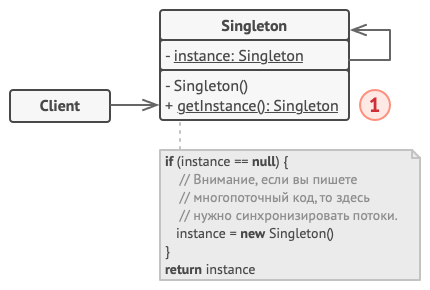

1. Одиночка определяет статический метод getInstance, который возвращает единственный экземпляр своего класса. Конструктор одиночки должен быть скрыт от клиентов. Вызов метода getInstance должен стать единственным способом получить объект этого класса.

#### Применимость

- Когда в программе должен быть единственный экземпляр какого-то класса, доступный всем клиентам (например, общий доступ к базе данных из разных частей программы)
- Когда вам хочется иметь больше контроля над глобальными переменными

#### Примеры

Всегда возвращаем первый экземпляр. Класс:

```js
class Singleton {
  constructor() {
    if (typeof Singleton.instance === 'object') {
      return Singleton.instance
    }
    Singleton.instance = this
    return this
  }
}
```

Объект и IIFE:

```js
const Singleton = (() => {
  let instance = null

  function init() {
    const name = 'Одиночка'
    const log = (value) => console.log(value)

    function setName(value) {
      const name = value
      return name
    }

    function getName() {
      log(`Этот паттерн называется "${setName(name)}"`)
    }
    return {
      getInfo: () => {
        getName()
        log(`Он позволяет создать лишь один экземпляр`)
      }
    }
  }

  return {
    getInstance() {
      if (!instance) instance = init()
      return instance
    }
  }
})()

const single1 = Singleton.getInstance()
const single2 = Singleton.getInstance()

single2.getInfo()
/*
Этот паттерн называется "Одиночка"
Он позволяет создать лишь один экземпляр
*/

console.log(single1 === single2) // true
```

Запрещаем создавать больше одного экземпляра:

```js
class ClassSingleton {
  static #instances = 0
  constructor(name) {
    ClassSingleton.#instances++
    if (ClassSingleton.#instances > 1) {
      throw new Error('Невозможно создать еще один экземпляр!')
    }
    this.name = name
  }
  getInfo() {
    console.log(`Экземпляр "${this.name}" является уникальным`)
  }
}

const singleton1 = new ClassSingleton('foo')
singleton1.getInfo()
// Экземпляр "foo" является уникальным

const singleton2 = new ClassSingleton('bar')
// Error: Невозможно создать еще один экземпляр!
```

### <a name="module"></a> Модуль

#### Примеры

Инкапсуляция переменных и функций:

```js
const CounterModule = (() => {
  // частная (приватная) переменная
  let counter = 1

  // частная функция
  function getInfo() {
    console.log(counter)
  }

  return {
    // открытые (публичные) функции
    increment() {
      counter < 3 ? counter++ : counter
      getInfo()
    },
    decrement() {
      counter > 1 ? counter-- : counter
      getInfo()
    },
    reset() {
      counter = 1
      getInfo()
    }
  }
})()

CounterModule.decrement() // 1
CounterModule.increment() // 2
CounterModule.increment() // 3
CounterModule.increment() // 3
CounterModule.reset() // 1
console.log(CounterModule.counter) // undefined
// CounterModule.getInfo() // TypeError: CounterModule.getInfo is not a function
```

Корзина для товаров. IIFE:

```js
const cartModule = (() => {
  const cart = []

  function getProductCount() {
    return cart.length
  }

  function getTotalPrice() {
    let total = 0
    for (const item of cart) {
      total += item.price
    }
    return total
  }

  return {
    addProducts(products) {
      products.forEach((product) => {
        cart.push(product)
      })
    },
    removeProduct(product) {
      const key = Object.keys(product)[0]
      const value = Object.values(product)[0]

      const index = cart.findIndex((item) => item[key] === value)

      cart.splice(index, 1)
    },
    getInfo() {
      console.log(
        `В корзине ${getProductCount()} товар(а) на ${
          getProductCount() > 1 ? 'общую ' : ''
        }сумму ${getTotalPrice()} рублей`
      )
    }
  }
})()

const products = [
  {
    id: '1',
    title: 'Хлеб',
    price: 50
  },
  {
    id: '2',
    title: 'Масло',
    price: 150
  },
  {
    id: '3',
    title: 'Молоко',
    price: 100
  }
]

cartModule.addProducts(products)
cartModule.getInfo()
// В корзине 3 товар(а) на общую сумму 300 рублей

cartModule.removeProduct({ id: '2' })
cartModule.getInfo()
// В корзине 2 товар(а) на общую сумму 250 рублей

cartModule.removeProduct({ title: 'Молоко' })
cartModule.getInfo()
// В корзине 1 товар(а) на сумму 100 рублей

console.log(cartModule.cart) // undefined
// cartModule.getProductCount() // Uncaught TypeError: cartModule.getProductCount is not a function
```

Класс:

```js
class Cart {
  #cart = []

  #getProductCount() {
    return this.#cart.length
  }

  #getTotalPrice() {
    return this.#cart.reduce((total, { price }) => (total += price), 0)
  }

  addProducts(products) {
    this.#cart.push(...products)
  }

  removeProduct(product) {
    for (const key in product) {
      const value = product[key]
      this.#cart = this.#cart.filter((item) => item[key] !== value)
    }
  }

  getInfo() {
    console.log(
      `В корзине ${this.#getProductCount()} товар(а) на ${
        this.#getProductCount() > 1 ? 'общую ' : ''
      }сумму ${this.#getTotalPrice()} рублей`
    )
  }
}

const cart = new Cart()

cart.addProducts(products)
cart.getInfo()
// В корзине 3 товар(а) на общую сумму 300 рублей

cart.removeProduct({ id: '2' })
cart.getInfo()
// В корзине 2 товар(а) на общую сумму 200 рублей

cart.removeProduct({ title: 'Молоко' })
cart.getInfo()
// В корзине 1 товар(а) на сумму 50 рублей

console.log(cart.cart) // undefined
// console.log(cart.#cart) // Uncaught SyntaxError: Private field '#cart' must be declared in an enclosing class
// cart.getTotalPrice() // TypeError: cart.getTotal is not a function
// cart.#getTotalPrice() // Error
```

Не путать с CommonJS, ES6 и другими полноценными модулями.

## Структурные паттерны

### <a name="adapter"></a> Адаптер

Адаптер — это структурный паттерн проектирования, который позволяет объектам с несовместимыми интерфейсами работать вместе.

#### Структура

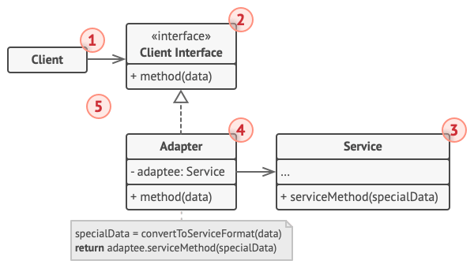

1. Клиент — это класс, который содержит существующую бизнес-логику программы.
2. Клиентский интерфейс описывает протокол, через который клиент может работать с другими классами.
3. Сервис — это какой-то полезный класс, обычно сторонний. Клиент не может использовать этот класс напрямую, так как сервис имеет непонятный ему интерфейс.
4. Адаптер — это класс, который может одновременно работать и с клиентом, и с сервисом. Он реализует клиентский интерфейс и содержит ссылку на объект сервиса. Адаптер получает вызовы от клиента через методы клиентского интерфейса, а затем переводит их в вызовы методов обёрнутого объекта в правильном формате.
5. Работая с адаптером через интерфейс, клиент не привязывается к конкретному классу адаптера. Благодаря этому, вы можете добавлять в программу новые виды адаптеров, независимо от клиентского кода. Это может пригодиться, если интерфейс сервиса вдруг изменится, например, после выхода новой версии сторонней библиотеки.

#### Задача

В этом шуточном примере Адаптер преобразует один интерфейс в другой, позволяя совместить квадратные колышки и круглые отверстия.


Адаптер вычисляет наименьший радиус окружности, в которую можно вписать квадратный колышек, и представляет его как круглый колышек с этим радиусом.

#### Применимость

- Когда вы хотите использовать сторонний класс, но его интерфейс не соответствует остальному коду приложения
- Когда вам нужно использовать несколько существующих подклассов, но в них не хватает какой-то общей функциональности, причём расширить суперкласс вы не можете

#### Пример

```js
class Soldier {
  constructor(level) {
    this.level = level
  }
  attack() {
    return this.level * 10
  }
}
class Jedi {
  constructor(level) {
    this.level = level
  }
  attackWithSaber() {
    return this.level * 100
  }
}
class JediAdapter {
  constructor(jedi) {
    this.jedi = jedi
  }
  attack() {
    return this.jedi.attackWithSaber()
  }
}
```

### <a name="bridge"></a> Мост

Мост — это структурный паттерн проектирования, который разделяет один или несколько классов на две отдельные иерархии — абстракцию и реализацию, позволяя изменять их независимо друг от друга.

#### Структура

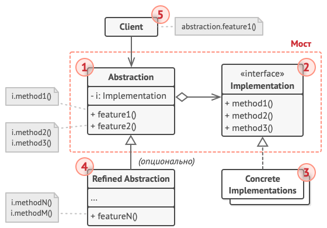

1. Абстракция содержит управляющую логику. Код абстракции делегирует реальную работу связанному объекту реализации.
2. Реализация задаёт общий интерфейс для всех реализаций. Все методы, которые здесь описаны, будут доступны из класса абстракции и его подклассов.
3. Конкретные реализации содержат платформо-зависимый код.
4. Расширенные абстракции содержат различные вариации управляющей логики. Как и родитель, работает с реализациями только через общий интерфейс реализации.
5. Клиент работает только с объектами абстракции. Не считая начального связывания абстракции с одной из реализаций, клиентский код не имеет прямого доступа к объектам реализации.

#### Задача

В представленной ниже схеме Мост разделяет монолитный код приборов и пультов на две части: приборы (выступают реализацией) и пульты управления ими (выступают абстракцией).

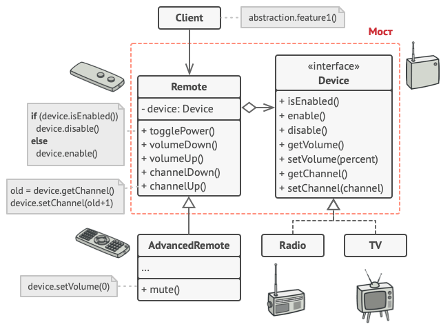

Класс пульта имеет ссылку на объект прибора, которым он управляет. Пульты работают с приборами через общий интерфейс. Это даёт возможность связать пульты с различными приборами.

Сами пульты можно развивать независимо от приборов. Для этого достаточно создать новый подкласс абстракции. Вы можете создать как простой пульт с двумя кнопками, так и более сложный пульт с тач-интерфейсом.

Клиентскому коду остаётся выбрать версию абстракции и реализации, с которым он хочет работать, и связать их между собой.

#### Применимость

- Когда вы хотите разделить монолитный класс, который содержит несколько различных реализаций какой-то функциональности (например, если класс может работать с разными системами баз данных)
- Когда класс нужно расширять в двух независимых плоскостях
- Когда вы хотите, чтобы реализацию можно было бы изменять во время выполнения программы

#### Примеры

Связь между страницей и цветовой схемой:

```js
class About {
  constructor(theme) {
    this.theme = theme
  }
  getContent() {
    return `About page in ${this.theme.getColor()}`
  }
}

class Careers {
  constructor(theme) {
    this.theme = theme
  }
  getContent() {
    return `Careers page in ${this.theme.getColor()}`
  }
}

class DarkTheme {
  getColor() {
    return 'Dark Theme'
  }
}

class LightTheme {
  getColor() {
    return 'Light Theme'
  }
}

const darkTheme = new DarkTheme()
const lightTheme = new LightTheme()

const about = new About(darkTheme)
const careers = new Careers(lightTheme)

console.log(about.getContent()) // About page in Dark Theme
console.log(careers.getContent()) // Careers page in Light Theme
```

Связь между принтером и используемой им краской:

```js
class Printer {
  constructor(ink) {
    this.ink = ink
  }
}

class EpsonPrinter extends Printer {
  constructor(ink) {
    super(ink)
  }
  print() {
    return `Printer: Epson, Ink: ${this.ink.get()}`
  }
}

class HPPrinter extends Printer {
  constructor(ink) {
    super(ink)
  }
  print() {
    return `Printer: HP, Ink: ${this.ink.get()}`
  }
}

class Ink {
  constructor(type) {
    this.type = type
  }
  get() {
    return this.type
  }
}

class AcrylicInk extends Ink {
  constructor() {
    super('acrylic-based')
  }
}

class AlcoholInk extends Ink {
  constructor() {
    super('alcohol-based')
  }
}

export { EpsonPrinter, HPPrinter, AcrylicInk, AlcoholInk }
```

### <a name="composite"></a> Компоновщик

Компоновщик — это структурный паттерн проектирования, который позволяет сгруппировать множество объектов в древовидную структуру, а затем работать с ней так, как будто это единичный объект.

#### Структура

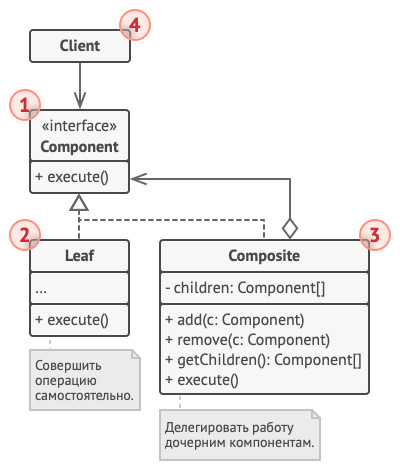

1. Компонент определяет общий интерфейс для простых и составных компонентов дерева.
2. Лист — это простой компонент дерева, не имеющий ответвлений.
3. Контейнер (или композит) — это составной компонент дерева. Он содержит набор дочерних компонентов, но ничего не знает об их типах. Это могут быть как простые компоненты-листья, так и другие компоненты-контейнеры. Но это не является проблемой, если все дочерние компоненты следуют единому интерфейсу.
4. Клиент работает с деревом через общий интерфейс компонентов.

#### Задача

В представленной ниже схеме Компоновщик помогает реализовать вложенные геометрические фигуры.


Класс CompoundGraphic может содержать любое количество подфигур, включая такие же контейнеры, как он сам. Контейнер реализует те же методы, что и простые фигуры. Но, вместо непосредственного действия, он передаёт вызовы всем вложенным компонентам, используя рекурсию. Затем он как бы «суммирует» результаты всех вложенных фигур.

Клиентский код работает со всеми фигурами через общий интерфейс фигур и не знает, что перед ним — простая фигура или составная. Это позволяет клиентскому коду работать с деревьями объектов любой сложности, не привязываясь к конкретным классам объектов, формирующих дерево.

#### Применимость

- Когда вам нужно представить древовидную структуру объектов
- Когда клиенты должны единообразно трактовать простые и составные объекты

#### Примеры

Комплектующие компьютера:

```js
class Equipment {
  getPrice() {
    return this.price || 0
  }
  getName() {
    return this.name
  }
  setName(name) {
    this.name = name
  }
}

class Composite extends Equipment {
  constructor() {
    super()
    this.equipments = []
  }
  add(equipment) {
    this.equipments.push(equipment)
  }
  getPrice() {
    return this.equipments.map((e) => e.getPrice()).reduce((a, b) => a + b)
  }
}

class Cabinet extends Composite {
  constructor() {
    super()
    this.setName('cabinet')
  }
}

class FloppyDisk extends Equipment {
  constructor() {
    super()
    this.setName('Floppy Disk')
    this.price = 70
  }
}

class HardDrive extends Equipment {
  constructor() {
    super()
    this.setName('Hard Drive')
    this.price = 250
  }
}

class Memory extends Equipment {
  constructor() {
    super()
    this.setName('Memory')
    this.price = 280
  }
}

export { Cabinet, FloppyDisk, HardDrive, Memory }
```

Зарплата работников организации:

```js
class Developer {
  constructor(name, salary, roles) {
    this.name = name
    this.salary = salary
    this.roles = roles
  }

  getName() {
    return this.name
  }

  getSalary() {
    return this.salary
  }

  setSalary(value) {
    this.salary = value
  }

  getRoles() {
    return this.roles
  }

  develop() {}
}

class Designer {
  constructor(name, salary, roles) {
    this.name = name
    this.salary = salary
    this.roles = roles
  }

  getName() {
    return this.name
  }

  getSalary() {
    return this.salary
  }

  setSalary(value) {
    this.salary = value
  }

  getRoles() {
    return this.roles
  }

  design() {}
}

class Organization {
  constructor() {
    this.employees = []
  }

  addEmployee(employee) {
    this.employees.push(employee)
  }

  getTotalSalary() {
    let totalSalary = 0
    this.employees.forEach((e) => {
      totalSalary += e.getSalary()
    })
    return totalSalary
  }
}

const john = new Developer('John', 12000)
const jane = new Designer('Jane', 10000)

const organization = new Organization()

organization.addEmployee(john)
organization.addEmployee(jane)

console.log(organization.getTotalSalary()) // 22000
```

### <a name="decorator"></a> Декоратор

Декоратор — это структурный паттерн проектирования, который позволяет динамически добавлять объектам новую функциональность, оборачивая их в полезные «обёртки».

#### Структура

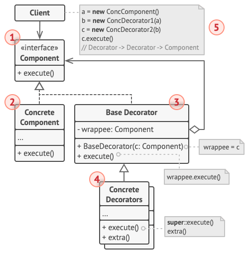

1. Компонент задаёт общий интерфейс обёрток и оборачиваемых объектов.
2. Конкретный компонент определяет класс оборачиваемых объектов. Он содержит какое-то базовое поведение, которое потом изменяют декораторы.
3. Базовый декоратор хранит ссылку на вложенный объект-компонент. Им может быть как конкретный компонент, так и один из конкретных декораторов. Базовый декоратор делегирует все свои операции вложенному объекту. Дополнительное поведение будет жить в конкретных декораторах.
4. Конкретные декораторы — это различные вариации декораторов, которые содержат добавочное поведение. Оно выполняется до или после вызова аналогичного поведения обёрнутого объекта.
5. Клиент может оборачивать простые компоненты и декораторы в другие декораторы, работая со всеми объектами через общий интерфейс компонентов.

#### Задача

В представленной ниже схеме Декоратор защищает финансовые данные дополнительными уровнями безопасности прозрачно для кода, который их использует.


Приложение оборачивает класс данных в шифрующую и сжимающую обёртки, которые при чтении выдают оригинальные данные, а при записи — зашифрованные и сжатые.

Декораторы, как и сам класс данных, имеют общий интерфейс. Поэтому клиентскому коду не важно, с чем работать — c «чистым» объектом данных или с «обёрнутым».

#### Применимость

- Когда вам нужно добавлять обязанности объектам на лету, незаметно для кода, который их использует
- Когда нельзя расширить обязанности объекта с помощью наследования

#### Примеры

Дополнительные ингредиенты к пасте:

```js
class Pasta {
  constructor() {
    this.price = 0
  }

  getPrice() {
    return this.price
  }
}

class Penne extends Pasta {
  constructor() {
    super()
    this.price = 8
  }
}

class PastaDecorator {
  constructor(pasta) {
    super()
    this.pasta = pasta
  }

  getPrice() {
    return this.pasta.getPrice()
  }
}

class SauseDecorator extends PastaDecorator {
  constructor(pasta) {
    super(pasta)
  }

  getPrice() {
    return super.getPrice() + 5
  }
}

class CheeseDecorator extends PastaDecorator {
  constructor(pasta) {
    super(pasta)
  }

  getPrice() {
    return super.getPrice() + 3
  }
}

export { Penne, SauseDecorator, CheeseDecorator }
```

Дополнительные ингредиенты к кофе:

```js
class SimpleCoffee {
  getCost() {
    return 10
  }

  getDescription() {
    return 'Простой кофе'
  }
}

class MilkCoffee {
  constructor(coffee) {
    this.coffee = coffee
  }

  getCost() {
    return this.getCost() + 2
  }

  getDescription() {
    return this.getDescription() + ', молоко'
  }
}

class WhipCoffee {
  constructor(coffee) {
    this.coffee = coffee
  }

  getCost() {
    return this.getCost() + 5
  }

  getDescription() {
    return this.getDescription() + ', сливки'
  }
}

class VanillaCoffee {
  constructor(coffee) {
    this.coffee = coffee
  }

  getCost() {
    return this.getCost() + 3
  }

  getDescription() {
    return this.getDescription() + ', ваниль'
  }
}

let someCoffee

someCoffee = new SimpleCoffee()
console.log(someCoffee.getCost()) // 10
console.log(someCoffee.getDescription()) // Простой кофе

someWhipCoffee = new WhipCoffee(someCoffee)
console.log(someWhipCoffee.getCost()) // 15
console.log(someWhipCoffee.getDescription()) // Простой кофе, сливки
```

Комплектующие Макбука:

```js
function MacBook() {
  this.cost = () => 996
  this.screenSize = () => 18
}

const memory = (macbook, v = macbook.cost()) => {
  macbook.cost = () => v + 74
}

const engraving = (macbook, v = macbook.cost()) => {
  macbook.cost = () => v + 200
}

const insurance = (macbook, v = macbook.cost()) => {
  macbook.cost = () => v + 250
}

const mb = new MacBook()

memory(mb)
engraving(mb)
insurance(mb)

console.log(mb.cost()) // 1520
console.log(mb.screenSize()) // 18

// абстрактный декоратор
// предопределенный конструктор интерфейса принимает
// название интерфейса и методы для распределения
/*
  const Macbook = new Interface('Macbook', [
    'addEngraving',
    'addParallels',
    'add4GBRam',
    'add8GBRam',
    'addCase'
  ])
*/

const MacbookPro = function () {}
MacbookPro.prototype = {
  addEngraving() {},
  addParallels() {},
  add4GBRam() {},
  add8GBRam() {},
  addCase() {},
  getPrice() {
    return 900.0
  }
}

// абстрактный (абстрагирующий) декоратор
const MacbookDecorator = function (macbook) {
  // Interface.ensureImplements(macbook, Macbook)
  this.macbook = macbook
}

MacbookDecorator.prototype = {
  addEngraving() {
    return this.macbook.addEngraving()
  },
  addParallels() {
    return this.macbook.addParallels()
  },
  add4GBRam() {
    return this.macbook.add4GBRam()
  },
  add8GBRam() {
    return this.macbook.add8GBRam()
  },
  addCase() {
    return this.macbook.addCase()
  },
  getPrice() {
    return this.macbook.getPrice()
  }
}

function extend(a, b) {
  for (const key in b) if (b.hasOwnProperty(key)) a[key] = b[key]
  return a
}
const CaseDecorator = function (macbook) {
  this.macbook = macbook
}

// расширяем CaseDecorator с помощью MacbookDecorator
extend(CaseDecorator, MacbookDecorator)

CaseDecorator.prototype = {
  addCase() {
    return this.macbook.addCase() + 'Улучшение произведено'
  },
  getPrice() {
    return this.macbook.getPrice() + 45.0
  }
}

const myMacbookPro = new MacbookPro()
console.log(myMacbookPro.getPrice()) // 900

const decoratedMacbookPro = new CaseDecorator(myMacbookPro)
console.log(decoratedMacbookPro.getPrice()) // 945
```

### <a name="facade"></a> Фасад

Фасад — это структурный паттерн проектирования, который предоставляет простой интерфейс к сложной системе классов, библиотеке или фреймворку.

#### Структура

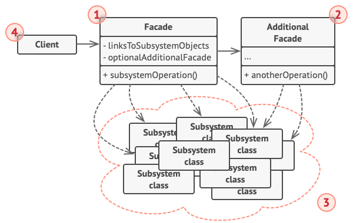

1. Фасад предоставляет быстрый доступ к определённой функциональности подсистемы. Он «знает», каким классам нужно переадресовать запрос, и какие данные для этого нужны.
2. Дополнительный фасад можно ввести, чтобы не «захламлять» единственный фасад разнородной функциональностью. Он может использоваться как клиентом, так и другими фасадами.
3. Сложная подсистема состоит из множества разнообразных классов. Для того, чтобы заставить их что-то делать, нужно знать подробности устройства подсистемы, порядок инициализации объектов и так далее.
4. Клиент использует фасад вместо прямой работы с объектами сложной подсистемы.

#### Задача

В представленной ниже схеме Фасад упрощает работу со сложным фреймворком видеоконвертации.


Вместо непосредственной работы с дюжиной классов, фасад предоставляет коду приложения единственный метод для конвертации видео, который сам заботится о том, чтобы правильно сконфигурировать нужные объекты фреймворка и получить требуемый результат.

#### Применимость

- Когда вам нужно представить простой или урезанный интерфейс к сложной подсистеме
- Когда вы хотите разложить подсистему на отдельные слои

#### Примеры

Общий пример. Функция-конструктор:

```js
const moduleObj = (() => {
  const log = console.log

  const _private = {
    i: 5,

    get() {
      log(`Текущее значение: ${this.i}`)
    },

    set(val) {
      this.i = val
    },

    run() {
      log('Выполнение запущено')
    },

    stop() {
      log('Выполнение остановлено')
    }
  }

  return {
    facade(args) {
      _private.set(args.val)
      _private.get()
      if (args.run) {
        _private.run()
      }
    }
  }
})()

moduleObj.facade({
  run: true,
  val: 10
})
/*
  Текущее значение: 10
  Выполнение запущено
*/
```

Класс:

```js
class Module {
  #private

  constructor() {
    this.#private = 5
  }

  #log(value) {
    console.log(value)
  }

  #get() {
    this.#log(`Текущее значение: ${this.#private}`)
  }

  #set(val) {
    this.#private = val
  }

  #run() {
    this.#log('Выполнение запущено')
  }

  #stop() {
    this.#log('Выполнение остановлено')
  }

  facade({ val, run, stop }) {
    this.#set(val)

    this.#get()

    if (run) {
      this.#run()
    }

    if (stop) {
      this.#stop()
    }
  }
}

const moduleClass = new Module()
moduleClass.facade({
  run: true,
  val: 10
})
/*
  Текущее значение: 10
  Выполнение запущено
*/

module.facade({
  val: 20,
  stop: true
})
/*
  Текущее значение: 20
  Выполнение остановлено
*/
```

Фасад магазина:

```js
class ShopFacade {
  constructor() {
    this.discount = new Discount()
    this.shipping = new Shipping()
    this.fees = new Fees()
  }

  calc(price) {
    price = this.discount.calc(price)
    price = this.fees.calc(price)
    price += this.shipping.calc()
    return price
  }
}

class Discount {
  calc(value) {
    return value * 0.9
  }
}

class Shipping {
  calc() {
    return 5
  }
}

class Fees {
  calc(value) {
    return value * 1.05
  }
}

export default ShopFacade
```

### <a name="flyweight"></a> Легковес

Легковес — это структурный паттерн проектирования, который позволяет вместить бóльшее количество объектов в отведённую оперативную память. Легковес экономит память, разделяя общее состояние объектов между собой, вместо хранения одинаковых данных в каждом объекте.

#### Структура

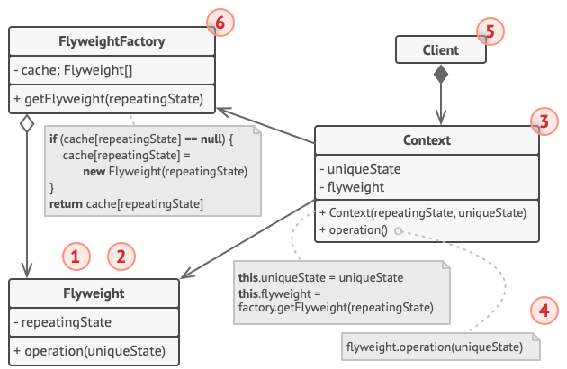

1. Вы всегда должны помнить о том, что Легковес применяется в программе, имеющей громадное количество одинаковых объектов. Этих объектов должно быть так много, чтобы они не помещались в доступную оперативную память без ухищрений. Паттерн разделяет данные этих объектов на две части — легковесы и контексты.
2. Легковес содержит состояние, которое повторялось во множестве первоначальных объектов. Один и тот же легковес можно использовать в связке со множеством контекстов. Состояние, которое хранится здесь, называется внутренним, а то, которое он получает извне — внешним.
3. Контекст содержит «внешнюю» часть состояния, уникальную для каждого объекта. Контекст связан с одним из объектов-легковесов, хранящих оставшееся состояние.
4. Поведение оригинального объекта чаще всего оставляют в Легковесе, передавая значения контекста через параметры методов. Тем не менее, поведение можно поместить и в контекст, используя легковес как объект данных.
5. Клиент вычисляет или хранит контекст, то есть внешнее состояние легковесов. Для клиента легковесы выглядят как шаблонные объекты, которые можно настроить во время использования, передав контекст через параметры.
6. Фабрика легковесов управляет созданием и повторным использованием легковесов. Фабрика получает запросы, в которых указано желаемое состояние легковеса. Если легковес с таким состоянием уже создан, фабрика сразу его возвращает, а если нет — создаёт новый объект.

#### Задача

В представленной ниже схеме Легковес помогает сэкономить оперативную память при отрисовке на экране миллионов объектов-деревьев.


Легковес выделяет повторяющуюся часть состояния из основного класса Tree и помещает его в дополнительный класс TreeType.

Теперь, вместо хранения повторяющихся данных во всех объектах, отдельные деревья будут ссылаться на несколько общих объектов, хранящих эти данные. Клиент работает с деревьями через фабрику деревьев, которая скрывает от него сложность кеширования общих данных деревьев.

Таким образом, программа будет использовать намного меньше оперативной памяти, что позволит отрисовать больше деревьев на экране на том же железе.

#### Применимость

- Когда не хватает оперативной памяти для поддержки всех нужных объектов.

#### Примеры

Создание цветов:

```js
class Color {
  constructor(name) {
    this.name = name
  }
}

export class ColorFactory {
  constructor() {
    this.colors = {}
  }

  create(name) {
    const color = this.color[name]
    if (color) return color
    this.colors[name] = new Color(name)
    return this.colors[name]
  }
}
```

Добавление книг в библиотечную систему:

```js
const Book = function (title, author, genre, pageCount, publisherID, ISBN) {
  this.title = title
  this.author = author
  this.genre = genre
  this.pageCount = pageCount
  this.publisherID = publisherID
  this.ISBN = ISBN
}

// фабрика по созданию книг - Одиночка
const BookFactory = (() => {
  const existingBooks = {}

  let existingBook = ''

  return {
    createBook(title, author, genre, pageCount, publisherID, ISBN) {
      existingBook = existingBooks[ISBN]

      if (!!existingBook) return existingBook
      else {
        const book = new Book(
          title,
          author,
          genre,
          pageCount,
          publisherID,
          ISBN
        )
        existingBook[ISBN] = book
        return book
      }
    }
  }
})()

// хранилище для записей о книгах - Одиночка
const BookRecordManager = (() => {
  const bookRecordDatabase = {}

  return {
    addBookRecord(
      id,
      title,
      author,
      genre,
      pageCount,
      publisherID,
      ISBN,
      checkoutDate,
      checkoutMember,
      dueReturnDate,
      availability
    ) {
      const book = BookFactory.createBook(
        title,
        author,
        genre,
        pageCount,
        publisherID,
        ISBN
      )

      bookRecordDatabase[id] = {
        checkoutMember,
        checkoutDate,
        dueReturnDate,
        availability,
        book
      }
    },

    updateCheckoutStatus(
      bookID,
      newStatus,
      checkoutDate,
      checkoutMember,
      newReturnDate
    ) {
      const record = bookRecordDatabase[bookID]
      record.availability = newStatus
      record.checkoutDate = checkoutDate
      record.checkoutMember = checkoutMember
      record.dueReturnDate = newReturnDate
    },

    extendCheckoutPeriod(bookID, newReturnDate) {
      bookRecordDatabase[bookID].dueReturnDate = newReturnDate
    },

    isPastDue(bookID) {
      const currentDate = new Date()
      return (
        currentDate.getTime() >
        Date.parse(bookRecordDatabase[bookID].dueReturnDate)
      )
    }
  }
})()
```

Учет заказов кофе:

```js
// симуляция чистого виртуального наследования/ключевого слова "implements"
Function.prototype.implementsFor = function (parentClassOrObject) {
  if (parentClassOrObject.constructor === Function) {
    // обычное наследование
    this.prototype = new parentClassOrObject()
    this.prototype.constructor = this
    this.prototype.parent = parentClassOrObject.prototype
  } else {
    // чистое виртуальное наследование
    this.prototype = parentClassOrObject
    this.prototype.constructor = this
    this.prototype.parent = parentClassOrObject
  }
  return this
}

// легковес
const CoffeeOrder = {
  serveCoffee(context) {},
  getFlavor() {}
}

function CoffeeFlavor(newFlavor) {
  const flavor = newFlavor

  if (typeof this.getFlavor === 'function') {
    this.getFlavor = () => flavor
  }

  if (typeof this.serveCoffee === 'function') {
    this.serveCoffee = (context) => {
      console.log(`Подача кофе ${flavor} на столик ${context.getTable()}`)
    }
  }
}

CoffeeFlavor.implementsFor(CoffeeOrder)
function CoffeeOrderContext(tableNumber) {
  return {
    getTable() {
      return tableNumber
    }
  }
}

function CoffeeFlavorFactory() {
  const flavors = {}

  let length = 0

  return {
    getCoffeeFlavor(flavorName) {
      let flavor = flavors[flavorName]
      if (typeof flavor === 'undefined') {
        flavor = new CoffeeFlavor(flavorName)
        flavors[flavorName] = flavor
        length++
      }
      return flavor
    },
    getTotalCoffeeFlavorsMade() {
      return length
    }
  }
}

function testFlyweight() {
  const flavors = []
  const tables = []
  let ordersMade = 0
  const flavorFactory = new CoffeeFlavorFactory()

  function takeOrders(flavorIn, table) {
    flavors.push(flavorFactory.getCoffeeFlavor(flavorIn))
    tables.push(new CoffeeOrderContext(table))
    ordersMade++
  }

  takeOrders('Cappuccino', 1)
  takeOrders('Cappuccino', 2)
  takeOrders('Frappe', 3)
  takeOrders('Frappe', 4)
  takeOrders('Xpresso', 5)
  takeOrders('Frappe', 4)
  takeOrders('Cappuccino', 3)
  takeOrders('Cappuccino', 2)
  takeOrders('Frappe', 1)
  takeOrders('Xpresso', 2)
  takeOrders('Cappuccino', 3)
  takeOrders('Xpresso', 4)
  takeOrders('Frappe', 5)
  takeOrders('Cappuccino', 1)
  takeOrders('Xpresso', 2)

  for (let i = 0; i < ordersMade; ++i) {
    flavors[i].serveCoffee(tables[i])
  }
  console.log(
    `Общее количество созданных объектов CoffeeFlavor (вкусов кофе):
    ${flavorFactory.getTotalCoffeeFlavorsMade()}`
  )
}

testFlyweight()
```

### <a name="mixin"></a> Примесь

#### Примеры

Добавление методов:

```js
const Car = function (settings) {
  this.model = settings.model || 'модель отсутствует'
  this.color = settings.color || 'цвет отсутствует'
}

const Mixin = function () {}

Mixin.prototype = {
  driveForward() {
    console.log('двигаемся вперед')
  },
  driveBackward() {
    console.log('двигаемся назад')
  },
  driveSideaways() {
    console.log('двигаемся в сторону')
  }
}

// функция расширения одного объекта методами другого объекта
function augment(receivingClass, givingClass, ...rest) {
  // несколько методов
  if (rest.length) {
    for (let i = 0; i < rest.length; i++) {
      receivingClass.prototype[rest[i]] = givingClass.prototype[rest[i]]
    }
    // все методы
  } else {
    for (const methodName in givingClass.prototype) {
      if (!Object.hasOwnProperty.call(receivingClass.prototype, methodName)) {
        receivingClass.prototype[methodName] = givingClass.prototype[methodName]

        // опциональная проверка цепочки прототипов
        // if (!receivingClass.prototype[methodName]) {
        //   receivingClass.prototype[methodName] = givingClass.prototype[methodName]
        // }
      }
    }
  }
}

augment(Car, Mixin, 'driveForward', 'driveBackward')

const car = new Car({
  model: 'Ford Escort',
  color: 'синий'
})

car.driveForward() // двигаемся вперед
car.driveBackward() // двигаемся назад

augment(Car, Mixin)

const car2 = new Car({
  model: 'Porsche',
  color: 'красный'
})

car2.driveSideaways() // двигаемся в сторону
```

Добавление обработчиков событий:

```js
const eventMixin = {
  on(name, handler) {
    if (!this._eventHandlers) this._eventHandlers = {}
    if (!this._eventHandlers[name]) this._eventHandlers[name] = []
    this._eventHandlers[name].push(handler)
  },

  off(name, handler) {
    const handlers = this._eventHandlers && this._eventHandlers[name]
    if (!handlers) return
    for (const h of handlers) {
      if (h === handler) handlers.splice(handlers.indexOf(h), 1)
    }
  },

  trigger(name, ...args) {
    if (!this._eventHandlers || !this._eventHandlers[name]) return
    this._eventHandlers[name].forEach((h) => h.apply(this, args))
  }
}

class Menu {
  choose(page) {
    this.trigger('select', page)
  }
}

Object.assign(Menu.prototype, eventMixin)

const menu = new Menu()

menu.on('select', (p) => console.log(`Текущая страница: ${p}`))

menu.choose('Контакты') // Текущая страница: Контакты
```

### <a name="proxy"></a> Прокси

Заместитель — это структурный паттерн проектирования, который позволяет подставлять вместо реальных объектов специальные объекты-заменители. Эти объекты перехватывают вызовы к оригинальному объекту, позволяя сделать что-то до или после передачи вызова оригиналу.

#### Структура

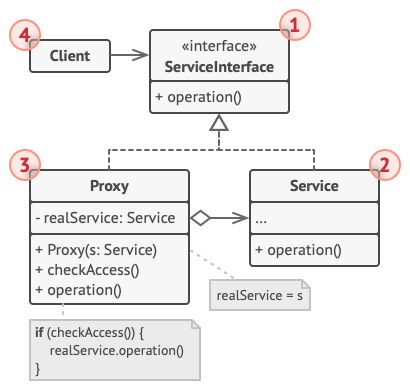

1. Интерфейс сервиса определяет общий интерфейс для сервиса и заместителя. Благодаря этому, объект заместителя можно использовать там, где ожидается объект сервиса.
2. Сервис содержит полезную бизнес-логику.
3. Заместитель хранит ссылку на объект сервиса. После того как заместитель заканчивает свою работу (например, инициализацию, логирование, защиту или другое), он передаёт вызовы вложенному сервису.
4. Клиент работает с объектами через интерфейс сервиса. Благодаря этому, его можно «одурачить», подменив объект сервиса объектом заместителя.

#### Задача

В представленной ниже схеме Заместитель помогает добавить в программу механизм ленивой инициализации и кеширования результатов работы библиотеки интеграции с YouTube.


Оригинальный объект начинал загрузку по сети, даже если пользователь запрашивал одно и то же видео. Заместитель же загружает видео только один раз, используя для этого служебный объект, но в остальных случаях возвращает закешированный файл.

#### Применимость

- Ленивая инициализация (виртуальный прокси). Когда у вас есть тяжёлый объект, грузящий данные из файловой системы или базы данных
- Защита доступа (защищающий прокси). Когда в программе есть разные типы пользователей, и вам хочется защищать объект от неавторизованного доступа. Например, если ваши объекты — это важная часть операционной системы, а пользователи — сторонние программы (хорошие или вредоносные)
- Локальный запуск сервиса (удалённый прокси). Когда настоящий сервисный объект находится на удалённом сервере
- Логирование запросов (логирующий прокси). Когда требуется хранить историю обращений к сервисному объекту
- Кеширование объектов («умная» ссылка). Когда нужно кешировать результаты запросов клиентов и управлять их жизненным циклом

#### Пример

```js
class Car {
  drive() {
    return 'driving'
  }
}

class CarProxy {
  constructor(driver) {
    this.driver = driver
  }

  drive() {
    return this.driver.age < 18 ? 'too young to drive' : new Car().drive()
  }
}

class Driver {
  constructor(age) {
    this.age = age
  }
}

export { Car, CarProxy, Driver }
```

Не путать со встроенным объектом "Proxy".

## Поведенческие паттерны

### <a name="resp"></a> Цепочка обязанностей

Цепочка обязанностей — это поведенческий паттерн проектирования, который позволяет передавать запросы последовательно по цепочке обработчиков. Каждый последующий обработчик решает, может ли он обработать запрос сам и стоит ли передавать запрос дальше по цепи.

#### Структура


1. Обработчик определяет общий для всех конкретных обработчиков интерфейс. Обычно достаточно описать единственный метод обработки запросов, но иногда здесь может быть объявлен и метод выставления следующего обработчика.

2. Базовый обработчик — опциональный класс, который позволяет избавиться от дублирования одного и того же кода во всех конкретных обработчиках.

3. Конкретные обработчики содержат код обработки запросов. При получении запроса каждый обработчик решает, может ли он обработать запрос, а также стоит ли передать его следующему объекту.

4. Клиент может либо сформировать цепочку обработчиков единожды, либо перестраивать её динамически, в зависимости от логики программы. Клиент может отправлять запросы любому из объектов цепочки, не обязательно первому из них.

#### Задача

В представленной ниже схеме Цепочка обязанностей отвечает за показ контекстной помощи для активных элементов пользовательского интерфейса.

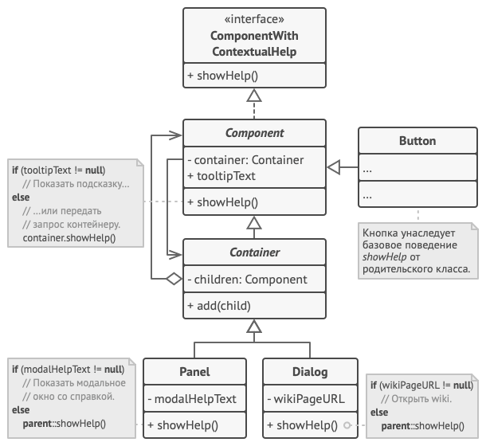

Графический интерфейс приложения обычно структурирован в виде дерева. Класс Диалог, отображающий всё окно приложения — это корень дерева. Диалог содержит Панели, которые, в свою очередь, могут содержать либо другие вложенные панели, либо простые элементы, вроде Кнопок.

Простые элементы могут показывать небольшие подсказки, если для них указан текст помощи. Но есть и более сложные компоненты, для которых этот способ демонстрации помощи слишком прост. Они определяют собственный способ отображения контекстной помощи.

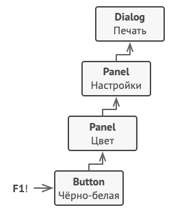

Когда пользователь наводит указатель мыши на элемент и жмёт клавишу F1, приложение шлёт этому элементу запрос на показ помощи. Если он не содержит никакой справочной информации, запрос путешествует далее по списку контейнера элемента, пока не находится тот, который способен отобразить помощь.

#### Применимость

- Когда программа должна обрабатывать разнообразные запросы несколькими способами, но заранее неизвестно, какие конкретно запросы будут приходить и какие обработчики для них понадобятся
- Когда важно, чтобы обработчики выполнялись один за другим в строгом порядке
- Когда набор объектов, способных обработать запрос, должен задаваться динамически

#### Примеры

Скидки на товары:

```js
class ShoppingCart {
  constructor() {
    this.products = []
  }
  addProduct(p) {
    this.products.push(p)
  }
}

class Discount {
  calc(products) {
    const ndiscount = new NumberDiscount()
    const pdiscount = new PriceDiscount()
    const none = new NoneDiscount()
    ndiscount.setNext(pdiscount)
    pdiscount.setNext(none)
    return ndiscount.exec(products)
  }
}

class NumberDiscount {
  constructor() {
    this.next = null
  }

  setNext(fn) {
    this.next = fn
  }

  exec(products) {
    let result = 0
    if (products.length > 3) result = 0.05
    return result + this.next.exec(products)
  }
}

class PriceDiscount {
  constructor() {
    this.next = null
  }

  setNext(fn) {
    this.next = fn
  }

  exec(products) {
    let result = 0
    const total = products.reduce((a, b) => a + b)
    if (total >= 500) result = 0.1
    return result + this.next.exec(products)
  }
}

class NoneDiscount {
  exec() {
    return 0
  }
}

export { ShoppingCart, Discount }
```

Способы оплаты:

```js
class Account {
  setNext(account) {
    this.successor = account
  }

  pay(amountToPay) {
    if (this.canPay(amountToPay)) {
      console.log(`${amountToPay} оплачено с помощью ${this.name}`)
    } else if (this.successor) {
      console.log(`Невозможно оплатить с помощью ${this.name}. Загрузка...`)
    } else {
      console.log('На балансе недостаточно средств')
    }
  }

  canPay(amount) {
    return this.balance >= amount
  }
}

class Bank extends Account {
  constructor(balance) {
    super()
    this.name = 'банк'
    this.balance = balance
  }
}

class Paypal extends Account {
  constructor(balance) {
    super()
    this.name = 'Paypal'
    this.balance = balance
  }
}

class Bitcoin extends Account {
  constructor(balance) {
    super()
    this.name = 'Bitcoin'
    this.balance = balance
  }
}

const bank = new Bank(100)
const paypal = new Paypal(200)
const bitcoin = new Bitcoin(300)

bank.setNext(paypal)
paypal.setNext(bitcoin)
bank.pay(259)
/*
  Невозможно оплатить с помощью банка. Загрузка...
  Невозможно оплатить с помощью банка. Загрузка...
  259 оплачено с помощью Bitcoin
*/
```

### <a name="command"></a> Команда

Команда — это поведенческий паттерн проектирования, который превращает запросы в объекты, позволяя передавать их как аргументы при вызове методов, ставить запросы в очередь, логировать их, а также поддерживать отмену операций.

#### Структура

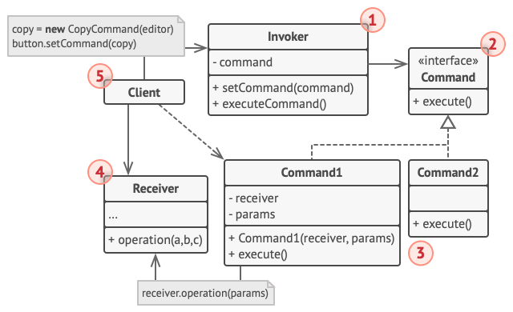

1. Отправитель хранит ссылку на объект команды и обращается к нему, когда нужно выполнить какое-то действие. Отправитель работает с командами только через их общий интерфейс. Он не знает, какую конкретно команду использует, так как получает готовый объект команды от клиента.

2. Команда описывает общий для всех конкретных команд интерфейс. Обычно здесь описан всего один метод для запуска команды.

3. Конкретные команды реализуют различные запросы, следуя общему интерфейсу команд. Обычно команда не делает всю работу самостоятельно, а лишь передаёт вызов получателю, которым является один из объектов бизнес-логики.

4. Получатель содержит бизнес-логику программы. В этой роли может выступать практически любой объект. Обычно команды перенаправляют вызовы получателям. Но иногда, чтобы упростить программу, вы можете избавиться от получателей, «слив» их код в классы команд.

5. Клиент создаёт объекты конкретных команд, передавая в них все необходимые параметры, среди которых могут быть и ссылки на объекты получателей. После этого клиент связывает объекты отправителей с созданными командами.

#### Задача

В представленной ниже схеме паттерн Команда служит для ведения истории выполненных операций, позволяя отменять их, если потребуется.


Команды, которые меняют состояние редактора (например, команда вставки текста из буфера обмена), сохраняют копию состояния редактора перед выполнением действия. Копии выполненных команд помещаются в историю команд, откуда они могут быть получены, если нужно будет сделать отмену операции.

Классы элементов интерфейса, истории команд и прочие не зависят от конкретных классов команд, так как работают с ними через общий интерфейс. Это позволяет добавлять в приложение новые команды, не изменяя существующий код.

#### Применимость

- Когда вы хотите параметризовать объекты выполняемым действием
- Когда вы хотите ставить операции в очередь, выполнять их по расписанию или передавать по сети
- Когда вам нужна операция отмены

#### Примеры

Общий пример:

```js
class Cockpit {
  constructor(command) {
    this.command = command
  }

  execute() {
    this.command.execute()
  }
}

class Turbine {
  constructor() {
    this.state = false
  }

  on() {
    this.state = true
  }

  off() {
    this.state = false
  }
}

class OnCommand {
  constructor(turbine) {
    this.turbine = turbine
  }

  execute() {
    this.turbine.on()
  }
}

class OffCommand {
  constructor(turbine) {
    this.turbine = turbine
  }

  execute() {
    this.turbine.off()
  }
}
```

Бронирование автомобиля:

```js
const carManager = (() => ({
  requestInfo(model, id) {
    return `Информация о ${model} с идентификатором ${id}: ...`
  },

  buyVehicle(model, id) {
    return `Вы успешно приобрели ${model} с идентификатором ${id}`
  },

  arrangeViewing(model, id) {
    return `Вы успешно забронировали ${model} с идентификатором ${id}`
  }
}))()

carManager.execute = (name, ...rest) => {
  console.log(carManager[name] && carManager[name].apply(carManager, rest))
}

carManager.execute('arrangeViewing', 'Ferrari', '14523')
carManager.execute('requestInfo', 'Ford Mondeo', '54323')
carManager.execute('requestInfo', 'Ford Escort', '34232')
carManager.execute('buyVehicle', 'Ford Escort', '34232')
/*
  Вы успешно забронировали Ferrari с идентификатором 14523
  Информация о Ford Mondeo с идентификатором 54323: ...
  Информация о Ford Escort с идентификатором 34232: ...
  Вы успешно приобрели Ford Escort с идентификатором 34232
*/
```

### <a name="interpret"></a> Интерпретатор

Данный паттерн является нестандартным.

#### Пример

```js
class Sum {
  constructor(left, right) {
    this.left = left
    this.right = right
  }

  interpret() {
    return this.left.interpret() + this.right.interpret()
  }
}

class Sub {
  constructor(left, right) {
    this.left = left
    this.right = right
  }

  interpret() {
    return this.left.interpret() - this.right.interpret()
  }
}

class Num {
  constructor(value) {
    this.value = value
  }

  interpret() {
    return this.value
  }
}

export { Num, Sub, Sum }
```

### <a name="iterator"></a> Итератор

Итератор — это поведенческий паттерн проектирования, который даёт возможность последовательно обходить элементы составных объектов, не раскрывая их внутреннего представления.

#### Структура

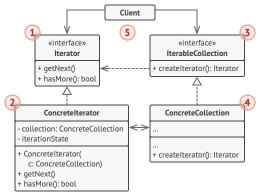

1. Итератор описывает интерфейс для доступа и обхода элементов коллекции.

2. Конкретный итератор реализует алгоритм обхода какой-то конкретной коллекции. Объект итератора должен сам отслеживать текущую позицию при обходе коллекции, чтобы отдельные итераторы могли обходить одну и ту же коллекцию независимо.

3. Коллекция описывает интерфейс получения итератора из коллекции. Как мы уже говорили, коллекции не всегда являются списком. Это может быть и база данных, и удалённое API, и даже дерево Компоновщика. Поэтому сама коллекция может создавать итераторы, так как она знает, какие именно итераторы способны с ней работать.

4. Конкретная коллекция возвращает новый экземпляр определённого конкретного итератора, связав его с текущим объектом коллекции. Обратите внимание, что сигнатура метода возвращает интерфейс итератора. Это позволяет клиенту не зависеть от конкретных классов итераторов.

5. Клиент работает со всеми объектами через интерфейсы коллекции и итератора. Так клиентский код не зависит от конкретных классов, что позволяет применять различные итераторы, не изменяя существующий код программы.

#### Задача

В представленной ниже схеме паттерн Итератор используется для реализации обхода нестандартной коллекции, которая инкапсулирует доступ к социальному графу Facebook. Коллекция предоставляет несколько итераторов, которые могут по-разному обходить профили людей.


Так, итератор друзей перебирает всех друзей профиля, а итератор коллег — фильтрует друзей по принадлежности к компании профиля. Все итераторы реализуют общий интерфейс, который позволяет клиентам работать с профилями, не вникая в детали работы с социальной сетью (например, в авторизацию, отправку REST-запросов и т.д.).

Кроме того, Итератор избавляет код от привязки к конкретным классам коллекций. Это позволяет добавить поддержку другого вида коллекций (например, LinkedIn), не меняя клиентский код, который работает с итераторами и коллекциями.

#### Применимость

- Когда у вас есть сложная структура данных, и вы хотите скрыть от клиента детали её реализации (из-за сложности или вопросов безопасности)
- Когда вам нужно иметь несколько вариантов обхода одной и той же структуры данных
- Когда вам хочется иметь единый интерфейс обхода различных структур данных

#### Примеры

Перебор элементов:

```js
class Iterator {
  constructor(el) {
    this.index = 0
    this.elements = el
  }

  next() {
    return this.elements[this.index++]
  }

  hasNext() {
    return this.index < this.elements.length
  }
}
```

Список радиостанций:

```js
class RadioStation {
  constructor(frequency) {
    this.frequency = frequency
  }

  getFrequency() {
    return this.frequency
  }
}

class StationList {
  constructor() {
    this.stations = []
  }

  addStation(station) {
    this.stations.push(station)
  }

  removeStation(station) {
    const frequencyToRemove = station.getFrequency()
    this.stations = this.stations.filter(
      (s) => s.getFrequency !== frequencyToRemove
    )
  }
}

const stationList = new StationList()

stationList.addStation(new RadioStation(89))
stationList.addStation(new RadioStation(101))
stationList.addStation(new RadioStation(102))
stationList.addStation(new RadioStation(103.2))

stationList.stations.forEach((s) => console.log(s.getFrequency()))

stationList.removeStation(new RadioStation(89))
```

Не путать со встроенными итераторами и генераторами.

### <a name="mediator"></a> Посредник

Посредник — это поведенческий паттерн проектирования, который позволяет уменьшить связанность множества классов между собой, благодаря перемещению этих связей в один класс-посредник.

#### Структура

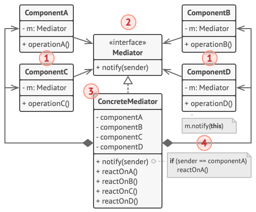

1. Компоненты — это разнородные объекты, содержащие бизнес-логику программы. Каждый компонент хранит ссылку на объект посредника, но работает с ним только через абстрактный интерфейс посредников. Благодаря этому, компоненты можно повторно использовать в другой программе, связав их с посредником другого типа.

2. Посредник определяет интерфейс для обмена информацией с компонентами. Обычно хватает одного метода, чтобы оповещать посредника о событиях, произошедших в компонентах. В параметрах этого метода можно передавать детали события: ссылку на компонент, в котором оно произошло, и любые другие данные.

3. Конкретный посредник содержит код взаимодействия нескольких компонентов между собой. Зачастую этот объект не только хранит ссылки на все свои компоненты, но и сам их создаёт, управляя дальнейшим жизненным циклом.

4. Компоненты не должны общаться друг с другом напрямую. Если в компоненте происходит важное событие, он должен оповестить своего посредника, а тот сам решит — касается ли событие других компонентов, и стоит ли их оповещать. При этом компонент-отправитель не знает кто обработает его запрос, а компонент-получатель не знает кто его прислал.

#### Задача

В представленной ниже схеме Посредник помогает избавиться от зависимостей между классами различных элементов пользовательского интерфейса: кнопками, чекбоксами и надписями.


По реакции на действия пользователей элементы не взаимодействуют напрямую, а всего лишь уведомляют посредника о том, что они изменились.

Посредник в виде диалога авторизации знает, как конкретные элементы должны взаимодействовать. Поэтому при получении уведомлений он может перенаправить вызов тому или иному элементу.

#### Применимость

- Когда вам сложно менять некоторые классы из-за того, что они имеют множество хаотичных связей с другими классами
- Когда вы не можете повторно использовать класс, поскольку он зависит от уймы других классов
- Когда вам приходится создавать множество подклассов компонентов, чтобы использовать одни и те же компоненты в разных контекстах

#### Примеры

Диспетчерская вышка:

```js
class TrafficTower {
  constructor() {
    this.airplanes = []
  }

  requestPositions() {
    return this.airplanes.map((a) => a.position)
  }
}

class Airplane {
  constructor(position, trafficTower) {
    this.position = position
    this.trafficTower = trafficTower
    this.trafficTower.airplanes.push(this)
  }

  requestPositions() {
    return this.trafficTower.requestPositions()
  }
}
```

Чат:

```js
class ChatRoom {
  showMessage(user, message) {
    const time = new Date().toLocaleTimeString()
    const sender = user.getName()
    console.log(`${time} [${sender}]: ${message}`)
  }
}

class User {
  constructor(name, chatMediator) {
    this.name = name
    this.chatMediator = chatMediator
  }

  getName() {
    return this.name
  }

  send(message) {
    this.chatMediator.showMessage(this, message)
  }
}

const mediator = new ChatRoom()

const john = new User('John', mediator)
const jane = new User('Jane', mediator)

john.send('Hi!')
jane.send('Bye!')
/*
  24.11.2020, 16:44:43 [John]: Hi!
  24.11.2020, 16:44:43 [Jane]: Bye!
*/
```

Анимация через делегирование событий:

[](https://codepen.io/harryheman/pen/GRjgyav)

### <a name="memento"></a> Снимок

Снимок — это поведенческий паттерн проектирования, который позволяет сохранять и восстанавливать прошлые состояния объектов, не раскрывая подробностей их реализации.

#### Структура

##### Классическая реализация на вложенных классах

Классическая реализация паттерна полагается на механизм вложенных классов, который доступен лишь в некоторых языках программирования.

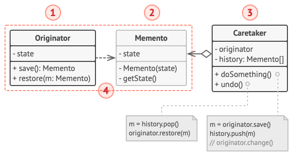

1. Создатель может производить снимки своего состояния, а также воспроизводить прошлое состояние, если подать в него готовый снимок.

2. Снимок — это простой объект данных, содержащий состояние создателя. Надёжнее всего сделать объекты снимков неизменяемыми, передавая в них состояние только через конструктор.

3. Опекун должен знать, когда делать снимок создателя и когда его нужно восстанавливать.

4. В данной реализации снимок — это внутренний класс по отношению к классу создателя. Именно поэтому он имеет полный доступ к полям и методам создателя, даже приватным. С другой стороны, опекун не имеет доступа ни к состоянию, ни к методам снимков и может всего лишь хранить ссылки на эти объекты.

##### Реализация с пустым промежуточным интерфейсом

Подходит для языков, не имеющих механизма вложенных классов.

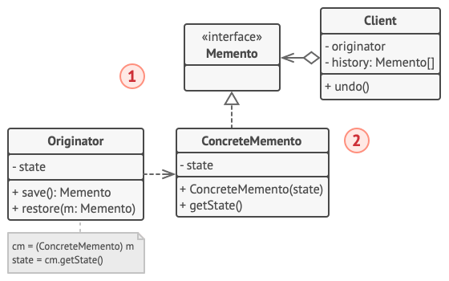

1. В этой реализации создатель работает напрямую с конкретным классом снимка, а опекун — только с его ограниченным интерфейсом.

2. Благодаря этому достигается тот же эффект, что и в классической реализации. Создатель имеет полный доступ к снимку, а опекун — нет.

##### Снимки с повышенной защитой

Когда нужно полностью исключить возможность доступа к состоянию создателей и снимков.

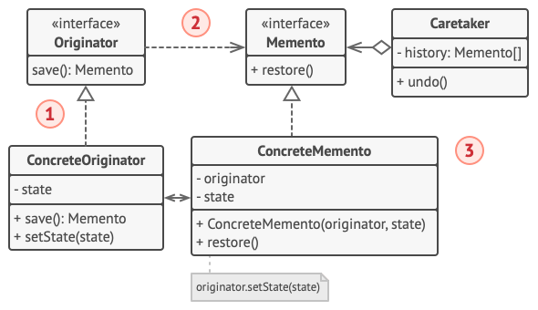

1. Эта реализация разрешает иметь несколько видов создателей и снимков. Каждому классу создателей соответствует свой класс снимков. Ни создатели, ни снимки не позволяют другим объектам прочесть своё состояние.

2. Здесь опекун ещё более жёстко ограничен в доступе к состоянию создателей и снимков. Но, с другой стороны, опекун становится независим от создателей, поскольку метод восстановления теперь находится в самих снимках.

3. Снимки теперь связаны с теми создателями, из которых они сделаны. Они по-прежнему получают состояние через конструктор. Благодаря близкой связи между классами, снимки знают, как восстановить состояние своих создателей.

#### Задача

В представленной ниже схеме паттерн Снимок используется совместно с паттерном Команда и позволяет хранить резервные копии сложного состояния текстового редактора и восстанавливать его, если потребуется.


Объекты команд выступают в роли опекунов и запрашивают снимки у редактора перед тем, как выполнить своё действие. Если потребуется отменить операцию, команда сможет восстановить состояние редактора, используя сохранённый снимок.

При этом снимок не имеет публичных полей, поэтому другие объекты не имеют доступа к его внутренним данным. Снимки связаны с определённым редактором, который их создал. Они же и восстанавливают состояние своего редактора. Это позволяет программе иметь одновременно несколько объектов редакторов, например, разбитых по разным вкладкам программы.

#### Применимость

- Когда вам нужно сохранять мгновенные снимки состояния объекта (или его части), чтобы впоследствии объект можно было восстановить в том же состоянии
- Когда прямое получение состояния объекта раскрывает приватные детали его реализации, нарушая инкапсуляцию

#### Примеры

Общий пример:

```js
class Memento {
  constructor(value) {
    this.value = value
  }
}

const origin = {
  store: (value) => new Memento(value),
  restore: (memento) => memento.value
}

class Caretaker {
  constructor() {
    this.values = []
  }

  addMemento(memento) {
    this.values.push(memento)
  }

  getMemento(index) {
    return this.values[index]
  }
}

export { origin, Caretaker }
```

Редактор текста:

```js
class EditorMemento {
  #content

  constructor(content) {
    this.#content = content
  }

  getContent() {
    return this.#content
  }
}

class Editor {
  #content

  constructor() {
    this.#content = ''
  }

  type(words) {
    this.#content += ` ${words}`
  }

  getContent() {
    return this.#content
  }

  save() {
    return new EditorMemento(this.#content)
  }

  restore(memento) {
    this.#content = memento.getContent()
  }
}

const editor = new Editor()

editor.type('foo')
editor.type('bar')

const saved = editor.save()

editor.type('baz')

console.log(editor.getContent()) // foo bar baz

editor.restore(saved)

console.log(editor.getContent()) // foo bar
```

### <a name="observer"></a> Наблюдатель

Наблюдатель — это поведенческий паттерн проектирования, который создаёт механизм подписки, позволяющий одним объектам следить и реагировать на события, происходящие в других объектах.

#### Структура


1. Издатель владеет внутренним состоянием, изменение которого интересно отслеживать подписчикам. Издатель содержит механизм подписки: список подписчиков и методы подписки/отписки.

2. Когда внутреннее состояние издателя меняется, он оповещает своих подписчиков. Для этого издатель проходит по списку подписчиков и вызывает их метод оповещения, заданный в общем интерфейсе подписчиков.

3. Подписчик определяет интерфейс, которым пользуется издатель для отправки оповещения. В большинстве случаев для этого достаточно единственного метода.

4. Конкретные подписчики выполняют что-то в ответ на оповещение, пришедшее от издателя. Эти классы должны следовать общему интерфейсу подписчиков, чтобы издатель не зависел от конкретных классов подписчиков.

5. По приходу оповещения подписчику нужно получить обновлённое состояние издателя. Издатель может передать это состояние через параметры метода оповещения. Более гибкий вариант — передавать через параметры весь объект издателя, чтобы подписчик мог сам получить требуемые данные. Как вариант, подписчик может постоянно хранить ссылку на объект издателя, переданный ему в конструкторе.

6. Клиент создаёт объекты издателей и подписчиков, а затем регистрирует подписчиков на обновления в издателях.

#### Задача

В представленной ниже схеме Наблюдатель позволяет объекту текстового редактора оповещать другие объекты об изменениях своего состояния.


Список подписчиков составляется динамически, объекты могут как подписываться на определённые события, так и отписываться от них прямо во время выполнения программы.

В этой реализации редактор не ведёт список подписчиков самостоятельно, а делегирует это вложенному объекту. Это даёт возможность использовать механизм подписки не только в классе редактора, но и в других классах программы.

Для добавления в программу новых подписчиков не нужно менять классы издателей, пока они работают с подписчиками через общий интерфейс.

#### Применимость

- Когда после изменения состояния одного объекта требуется что-то сделать в других, но вы не знаете наперёд, какие именно объекты должны отреагировать

#### Примеры

Наценки на товары:

```js
class Product {
  constructor() {
    this.price = 0
    this.actions = []
  }

  setBasePrice(value) {
    this.price = value
    this.notifyAll()
  }

  register(observer) {
    this.actions.push(observer)
  }

  unregister(observer) {
    this.actions = this.actions.filter((el) => !(el instanceof observer))
  }

  notifyAll() {
    return this.actions.forEach((el) => el.update(this))
  }
}

class Fees {
  update(product) {
    product.price = product.price \* 1.2
  }
}

class Proft {
  update(product) {
    product.price = product.price \* 2
  }
}
```

Наблюдение за DOM-элементами:

[](https://codepen.io/harryheman/pen/vYXEpqx)

Не путать со встроенными наблюдателями (MutationObserver, IntersectionObserver и т.д.).

### <a name="state"></a> Состояние

Состояние — это поведенческий паттерн проектирования, который позволяет объектам менять поведение в зависимости от своего состояния. Извне создаётся впечатление, что изменился класс объекта.

#### Структура

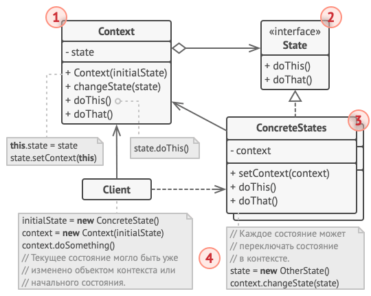

1. Контекст хранит ссылку на объект состояния и делегирует ему часть работы, зависящей от состояний. Контекст работает с этим объектом через общий интерфейс состояний. Контекст должен иметь метод для присваивания ему нового объекта-состояния.

2. Состояние описывает общий интерфейс для всех конкретных состояний.

3. Конкретные состояния реализуют поведения, связанные с определённым состоянием контекста. Иногда приходится создавать целые иерархии классов состояний, чтобы обобщить дублирующий код.

4. И контекст, и объекты конкретных состояний могут решать, когда и какое следующее состояние будет выбрано. Чтобы переключить состояние, нужно подать другой объект-состояние в контекст.

#### Задача

В представленной ниже схеме паттерн Состояние изменяет функциональность одних и тех же элементов управления музыкальным проигрывателем, в зависимости от того, в каком состоянии находится сейчас проигрыватель.


Объект проигрывателя содержит объект-состояние, которому и делегирует основную работу. Изменяя состояния, можно менять то, как ведут себя элементы управления проигрывателя.

#### Применимость

- Когда у вас есть объект, поведение которого кардинально меняется в зависимости от внутреннего состояния, причём типов состояний много, и их код часто меняется
- Когда код класса содержит множество больших, похожих друг на друга, условных операторов, которые выбирают поведения в зависимости от текущих значений полей класса
- Когда вы сознательно используете табличную машину состояний, построенную на условных операторах, но вынуждены мириться с дублированием кода для похожих состояний и переходов

#### Примеры

Редактор текста:

```js
const upper = (str) => str.toUpperCase()
const lower = (str) => str.toLowerCase()
const none = (str) => str

class TextEditor {
  #transform

  constructor(transform) {
    this.#transform = transform
  }

  setTransform(transform) {
    this.#transform = transform
  }

  type(words) {
    console.log(this.#transform(words))
  }
}

const editor = new TextEditor(none)

editor.type('foo') // foo

editor.setTransform(upper)

editor.type('bar') // BAR
editor.type('baz') // BAZ

editor.setTransform(lower)

editor.type('QUX') // qux
```

Статус заказа:

```js
class OrderStatus {
  constructor(name, nextStatus) {
    this.name = name
    this.nextStatus = nextStatus
  }

  next() {
    return new this.nextStatus()
  }
}

class WaitingForPayment extends OrderStatus {
  constructor() {
    super('waitingForPayment', Shipping)
  }
}

class Shipping extends OrderStatus {
  constructor() {
    super('shipping', Delivered)
  }
}

class Delivered extends OrderStatus {
  constructor() {
    super('delivered', Delivered)
  }
}

class Order {
  constructor() {
    this.state = new WaitingForPayment()
  }

  nextState() {
    this.state = this.state.next()
  }
}

export default Order
```

### <a name="strategy"></a> Стратегия

Стратегия — это поведенческий паттерн проектирования, который определяет семейство схожих алгоритмов и помещает каждый из них в собственный класс, после чего алгоритмы можно взаимозаменять прямо во время исполнения программы.

#### Структура

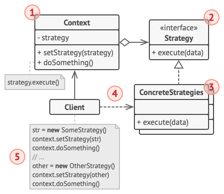

1. Контекст хранит ссылку на объект конкретной стратегии, работая с ним через общий интерфейс стратегий.

2. Стратегия определяет интерфейс, общий для всех вариаций алгоритма. Контекст использует этот интерфейс для вызова алгоритма.

3. Конкретные стратегии реализуют различные вариации алгоритма.

4. Во время выполнения программы контекст получает вызовы от клиента и делегирует их объекту конкретной стратегии.

5. Клиент должен создать объект конкретной стратегии и передать его в конструктор контекста. Кроме этого, клиент должен иметь возможность заменить стратегию на лету, используя сеттер. Благодаря этому, контекст не будет знать о том, какая именно стратегия сейчас выбрана.

#### Применимость

- Когда вам нужно использовать разные вариации какого-то алгоритма внутри одного объекта
- Когда у вас есть множество похожих классов, отличающихся только некоторым поведением
- Когда вы не хотите обнажать детали реализации алгоритмов для других классов
- Когда различные вариации алгоритмов реализованы в виде развесистого условного оператора. Каждая ветка такого оператора представляет собой вариацию алгоритма

#### Примеры

Корзина для товаров:

```js
class ShoppingCart {
  constructor(discount) {
    this.discount = discount
    this.amount = 0
  }

  checkout() {
    return this.discount(this.amount)
  }

  setAmount(amount) {
    this.amount = amount
  }
}

const guestStrategy = (amount) => amount
const regularStrategy = (amount) => amount _ 0.9
const premiumStrategy = (amount) => amount _ 0.8
```

Сортировка данных:

```js
const bubbleSort = (dataset) => {
  console.log('Применение сортировки пузырьком')
  // ...
  return dataset
}

const quickSort = (dataset) => {
  console.log('Применение быстрой сортировки')
  // ...
  return dataset
}

const sorter = (dataset) => (dataset.length > 5 ? quickSort : bubbleSort)

const longDataSet = [1, 5, 4, 3, 2, 8]
const shortDataSet = [1, 5, 4]

const sorter1 = sorter(longDataSet)
const sorter2 = sorter(shortDataSet)

sorter1(longDataSet) // Применение сортировки пузырьком
sorter1(shortDataSet) // Применение быстрой сортировки
```

### <a name="template"></a> Шаблон

Шаблонный метод — это поведенческий паттерн проектирования, который определяет скелет алгоритма, перекладывая ответственность за некоторые его шаги на подклассы. Паттерн позволяет подклассам переопределять шаги алгоритма, не меняя его общей структуры.

#### Структура

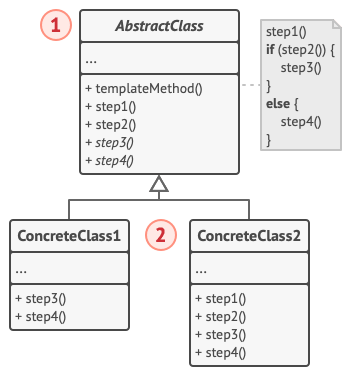

1. Абстрактный класс определяет шаги алгоритма и содержит шаблонный метод, состоящий из вызовов этих шагов. Шаги могут быть как абстрактными, так и содержать реализацию по умолчанию.

2. Конкретный класс переопределяет некоторые (или все) шаги алгоритма. Конкретные классы не переопределяют сам шаблонный метод.

#### Задача

В представленной ниже схеме Шаблонный метод используется как заготовка для стандартного искусственного интеллекта в простой игре-стратегии. Для введения в игру новой расы достаточно создать подкласс и реализовать в нём недостающие методы.


Все расы игры будут содержать примерно такие же типы юнитов и строений, поэтому структура ИИ будет одинаковой. Но разные расы могут по-разному реализовать эти шаги. Так, например, орки будут агрессивней в атаке, люди — более активны в защите, а дикие монстры вообще не будут заниматься строительством.

#### Применимость

- Когда подклассы должны расширять базовый алгоритм, не меняя его структуры
- Когда у вас есть несколько классов, делающих одно и то же с незначительными отличиями. Если вы редактируете один класс, то приходится вносить такие же правки и в остальные классы

#### Примеры

Налог:

```js
class Tax {
  calc(value) {
    if (value >= 1000) value = this.overThousand(value)
      return this.complementaryFee(value)
  }

  complementaryFee(value) {
    return value + 10
  }
}

class Tax2 extends Tax {
  constructor() {
    super()
  }

  overThousand(value) {
    return value \* 1.1
  }
}

class Tax3 extends Tax {
  constructor() {
    super()
  }

  overThousand(value) {
    return value \* 1.2
  }
}

export {
  Tax2,
  Tax3
}
```

Генератор разметки:

```js
class Template {
  #html
  // Одиночка
  constructor() {
    if (typeof Template.instance === 'object') {
      return Template.instance
    }

    Template.instance = this
    return this
  }

  init() {
    this.#html = ''
    return this
  }

  build(tag, content = '') {
    this.#html += `<${tag}>${content}</${tag}>`
    return this
  }

  get() {
    return this.#html
  }
}

const tempGen = new Template()

const temp1 = tempGen.init().build('ul').get()
const temp2 = tempGen
  .init()
  .build('li', 'foo')
  .build('li', 'bar')
  .build('li', 'baz')
  .get()

console.log(temp1) //
console.log(temp2) // - foo- bar- baz
```

### <a name="visitor"></a> Посетитель

Посетитель — это поведенческий паттерн проектирования, который позволяет добавлять в программу новые операции, не изменяя классы объектов, над которыми эти операции могут выполняться.

#### Структура

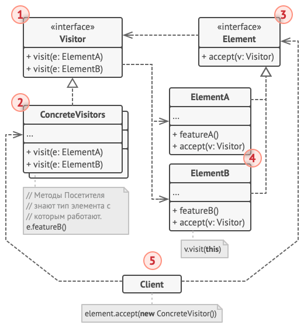

1. Посетитель описывает общий интерфейс для всех типов посетителей. Он объявляет набор методов, отличающихся типом входящего параметра, которые нужны для запуска операции для всех типов конкретных элементов. В языках, поддерживающих перегрузку методов, эти методы могут иметь одинаковые имена, но типы их параметров должны отличаться.

2. Конкретные посетители реализуют какое-то особенное поведение для всех типов элементов, которые можно подать через методы интерфейса посетителя.

3. Элемент описывает метод принятия посетителя. Этот метод должен иметь единственный параметр, объявленный с типом интерфейса посетителя.

4. Конкретные элементы реализуют методы принятия посетителя. Цель этого метода — вызвать тот метод посещения, который соответствует типу этого элемента. Так посетитель узнает, с каким именно элементом он работает.

5. Клиентом зачастую выступает коллекция или сложный составной объект, например, дерево Компоновщика. Зачастую клиент не привязан к конкретным классам элементов, работая с ними через общий интерфейс элементов.

#### Задача

В представленной ниже схеме Посетитель добавляет в существующую иерархию классов геометрических фигур возможность экспорта в XML.


#### Применимость

- Когда вам нужно выполнить какую-то операцию над всеми элементами сложной структуры объектов, например, деревом
- Когда над объектами сложной структуры объектов надо выполнять некоторые не связанные между собой операции, но вы не хотите «засорять» классы такими операциями
- Когда новое поведение имеет смысл только для некоторых классов из существующей иерархии

#### Пример

```js
function bonusVisitor(employee) {
  if (employee instanceof Manager) employee.bonus = employee.salary * 2
  if (employee instanceof Developer) employee.bonus = employee.salary
}

class Employee {
  constructor(salary) {
    this.bonus = 0
    this.salary = salary
  }

  accept(visitor) {
    visitor(this)
  }
}

class Manager extends Employee {
  constructor(salary) {
    super(salary)
  }
}

class Developer extends Employee {
  constructor(salary) {
    super(salary)
  }
}

export { Developer, Manager, bonusVisitor }
```
